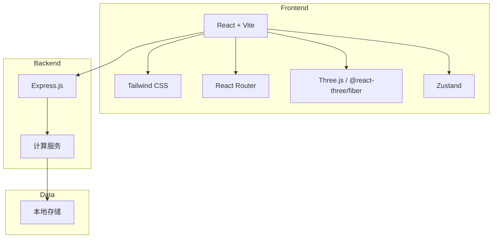
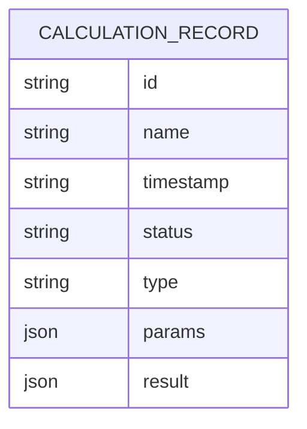

## 1. Architecture Design


## 2. Technology Description
- Frontend: React@18 + TypeScript + tailwindcss@3 + vite
- Initialization Tool: vite-init
- Backend: Express@4 (可选，用于复杂计算)
- 3D Visualization: Three.js + @react-three/fiber + @react-three/drei
- State Management: Zustand
- Routing: React Router DOM

## 3. Route Definitions
| Route | Purpose |
|-------|---------|
| / | Dashboard 首页 |
| /calculation | 时空计算页面 |
| /data | 数据管理页面 |
| /history | 历史记录页面 |

## 4. API Definitions
```typescript
// 计算参数类型
interface CalculationParams {
  startTime: string;
  endTime: string;
  spatialRange: {
    lat: number;
    lng: number;
    radius: number;
  };
  mode: 'basic' | 'advanced' | 'simulation';
  parameters: Record<string, any>;
}

// 计算结果类型
interface CalculationResult {
  id: string;
  timestamp: string;
  params: CalculationParams;
  data: any[];
  summary: {
    totalPoints: number;
    maxValue: number;
    minValue: number;
    avgValue: number;
  };
}

// 历史记录类型
interface HistoryRecord {
  id: string;
  name: string;
  timestamp: string;
  status: 'completed' | 'running' | 'failed';
  type: string;
  thumbnail?: string;
}
```

## 5. Data Model
### 5.1 Data Model Definition


### 5.2 Data Storage
使用 localStorage 存储计算历史记录，结构如下：
```typescript
// LocalStorage schema
interface LocalStorageData {
  calculationHistory: HistoryRecord[];
  savedCalculations: CalculationResult[];
  userPreferences: {
    theme: 'dark' | 'light';
    viewMode: '3d' | '2d';
  };
}
```
