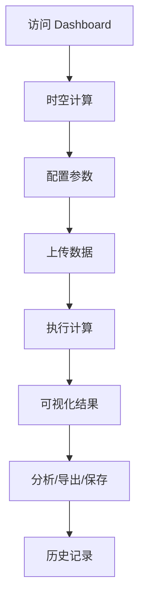
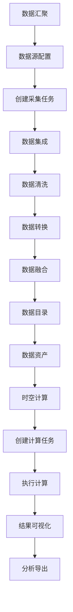

## 1. Product Overview
「HX-时空计算引擎」是一个面向未来的时空数据可视化与计算平台，提供沉浸式的时空数据分析、模拟推演和智能决策支持。
- 解决传统时空分析工具缺乏直观交互、复杂计算难以理解的问题，为科研、规划和决策人员提供强大的可视化和计算能力
- 目标成为行业领先的时空数据处理与可视化平台，提升时空数据分析效率

## 2. Core Features

### 2.1 User Roles
| Role | Registration Method | Core Permissions |
|------|---------------------|------------------|
| 普通用户 | 浏览使用基础功能 | 查看时空数据、使用基础计算、浏览历史记录 |
| 专业用户 | 专业认证 | 高级计算功能、自定义模拟、数据导出 |

### 2.2 Feature Module
1. **Dashboard**: 时空数据概览、核心指标展示、快捷操作入口
2. **时空计算**: 多维度数据计算、模拟推演、结果可视化
3. **数据管理**: 数据上传、数据预览、数据筛选
4. **历史记录**: 计算历史、结果对比、收藏管理

### 2.3 Page Details
| Page Name | Module Name | Feature description |
|-----------|-------------|---------------------|
| Dashboard | Hero Section | 沉浸式标题动画、系统介绍、快速开始按钮 |
| Dashboard | Key Metrics | 实时数据展示、动态数值变化、趋势图表 |
| Dashboard | Quick Actions | 核心功能快捷入口、图标动画、悬停效果 |
| Spacetime Calculation | Data Input | 参数配置、时空范围选择、计算模式切换 |
| Spacetime Calculation | Visualization | 3D/2D时空展示、数据图层、交互控制 |
| Spacetime Calculation | Results | 结果展示、详细数据、导出功能 |
| Data Management | Upload Area | 拖拽上传、文件预览、格式支持 |
| Data Management | Data List | 数据列表、筛选搜索、操作菜单 |
| History | Record List | 历史计算记录、时间线展示、结果对比 |

## 3. Core Process
用户访问 Dashboard 了解系统功能 → 选择时空计算功能 → 配置参数并上传数据 → 系统执行计算并可视化结果 → 用户分析结果、导出数据或保存计算记录



## 4. User Interface Design
### 4.1 Design Style
- **Primary Colors**: 深空蓝 (#0F172A)、科技蓝 (#3B82F6)、星空紫 (#7C3AED)
- **Button Style**: 渐变圆角按钮、悬停发光效果、点击动画
- **Font**: 未来感无衬线字体 Orbitron（标题）+ Inter（正文）
- **Layout Style**: 卡片式布局、玻璃态效果、深色主题
- **Icon Style**: 线性图标、科技感配色、微妙动画

### 4.2 Page Design Overview
| Page Name | Module Name | UI Elements |
|-----------|-------------|-------------|
| Dashboard | Hero Section | 渐变背景、粒子动画、居中布局、大型标题 |
| Dashboard | Key Metrics | 玻璃态卡片、动态数字、趋势箭头、色彩区分 |
| Dashboard | Quick Actions | 网格布局、图标卡片、悬停放大、色彩渐变 |
| Spacetime Calculation | Visualization | 深色背景、3D视差、图层控制、交互工具栏 |
| Data Management | Upload Area | 虚线边框、拖拽提示、文件图标、进度动画 |
| History | Record List | 时间线布局、状态标签、对比按钮、展开详情 |

### 4.3 Responsiveness
- Desktop-first design, adaptive to tablet and mobile
- Touch-optimized interactive elements
- Collapsible sidebar on mobile
- Responsive grid layout for content areas

### 4.4 3D Scene Guidance
- **Environment**: 深空星空背景，HDRI 环境贴图
- **Lighting**: 蓝色主光源 + 紫色补光，营造科技氛围
- **Camera**: 轨道控制器，支持缩放、旋转、平移
- **Composition**: 中心数据可视化主体 + 周围控制面板
- **Interactions**: 点击选择、悬停高亮、数据详情弹窗
- **Animations**: 粒子流动、数据脉动、视角过渡
- **Post-processing**: 轻微辉光效果、色彩校正
## 1. Product Overview
「## 1. Product Overview
「HX-时空计算引擎」是一个企业级时空大数据处理与分析平台，提供从数据## 1. Product Overview
「HX-时空计算引擎」是一个企业级时空大数据处理与分析平台，提供从数据接入、汇聚、集成、管理、计算、## 1. Product Overview
「HX-时空计算引擎」是一个企业级时空大数据处理与分析平台，提供从数据接入、汇聚、集成、管理、计算、可视化的全流程解决方案。
- 解决时空数据分散、处理复杂、分析困难的问题，为政府、科研、企业用户提供## 1. Product Overview
「HX-时空计算引擎」是一个企业级时空大数据处理与分析平台，提供从数据接入、汇聚、集成、管理、计算、可视化的全流程解决方案。
- 解决时空数据分散、处理复杂、分析困难的问题，为政府、科研、企业用户提供一站式时空数据处理能力
- 目标成为## 1. Product Overview
「HX-时空计算引擎」是一个企业级时空大数据处理与分析平台，提供从数据接入、汇聚、集成、管理、计算、可视化的全流程解决方案。
- 解决时空数据分散、处理复杂、分析困难的问题，为政府、科研、企业用户提供一站式时空数据处理能力
- 目标成为国内领先的时空计算引擎平台，赋能各行业时空数据分析应用

## 2. Core## 1. Product Overview
「HX-时空计算引擎」是一个企业级时空大数据处理与分析平台，提供从数据接入、汇聚、集成、管理、计算、可视化的全流程解决方案。
- 解决时空数据分散、处理复杂、分析困难的问题，为政府、科研、企业用户提供一站式时空数据处理能力
- 目标成为国内领先的时空计算引擎平台，赋能各行业时空数据分析应用

## 2. Core Features

### 2.1 User Roles
| Role | Registration Method | Core Permissions |## 1. Product Overview
「HX-时空计算引擎」是一个企业级时空大数据处理与分析平台，提供从数据接入、汇聚、集成、管理、计算、可视化的全流程解决方案。
- 解决时空数据分散、处理复杂、分析困难的问题，为政府、科研、企业用户提供一站式时空数据处理能力
- 目标成为国内领先的时空计算引擎平台，赋能各行业时空数据分析应用

## 2. Core Features

### 2.1 User Roles
| Role | Registration Method | Core Permissions |
|------|---------------------|------------------|
| 普通用户 | 账号登录 |## 1. Product Overview
「HX-时空计算引擎」是一个企业级时空大数据处理与分析平台，提供从数据接入、汇聚、集成、管理、计算、可视化的全流程解决方案。
- 解决时空数据分散、处理复杂、分析困难的问题，为政府、科研、企业用户提供一站式时空数据处理能力
- 目标成为国内领先的时空计算引擎平台，赋能各行业时空数据分析应用

## 2. Core Features

### 2.1 User Roles
| Role | Registration Method | Core Permissions |
|------|---------------------|------------------|
| 普通用户 | 账号登录 | 数据浏览、基础计算、查看报表 |
| 管理员 | 系统管理员账号 |## 1. Product Overview
「HX-时空计算引擎」是一个企业级时空大数据处理与分析平台，提供从数据接入、汇聚、集成、管理、计算、可视化的全流程解决方案。
- 解决时空数据分散、处理复杂、分析困难的问题，为政府、科研、企业用户提供一站式时空数据处理能力
- 目标成为国内领先的时空计算引擎平台，赋能各行业时空数据分析应用

## 2. Core Features

### 2.1 User Roles
| Role | Registration Method | Core Permissions |
|------|---------------------|------------------|
| 普通用户 | 账号登录 | 数据浏览、基础计算、查看报表 |
| 管理员 | 系统管理员账号 | 全部功能、数据管理、用户管理 |
| 系统管理员 | 超级管理员 |## 1. Product Overview
「HX-时空计算引擎」是一个企业级时空大数据处理与分析平台，提供从数据接入、汇聚、集成、管理、计算、可视化的全流程解决方案。
- 解决时空数据分散、处理复杂、分析困难的问题，为政府、科研、企业用户提供一站式时空数据处理能力
- 目标成为国内领先的时空计算引擎平台，赋能各行业时空数据分析应用

## 2. Core Features

### 2.1 User Roles
| Role | Registration Method | Core Permissions |
|------|---------------------|------------------|
| 普通用户 | 账号登录 | 数据浏览、基础计算、查看报表 |
| 管理员 | 系统管理员账号 | 全部功能、数据管理、用户管理 |
| 系统管理员 | 超级管理员 | 系统配置、权限管理、资源监控 |## 1. Product Overview
「HX-时空计算引擎」是一个企业级时空大数据处理与分析平台，提供从数据接入、汇聚、集成、管理、计算、可视化的全流程解决方案。
- 解决时空数据分散、处理复杂、分析困难的问题，为政府、科研、企业用户提供一站式时空数据处理能力
- 目标成为国内领先的时空计算引擎平台，赋能各行业时空数据分析应用

## 2. Core Features

### 2.1 User Roles
| Role | Registration Method | Core Permissions |
|------|---------------------|------------------|
| 普通用户 | 账号登录 | 数据浏览、基础计算、查看报表 |
| 管理员 | 系统管理员账号 | 全部功能、数据管理、用户管理 |
| 系统管理员 | 超级管理员 | 系统配置、权限管理、资源监控 |

### 2.2 Feature Module
1## 1. Product Overview
「HX-时空计算引擎」是一个企业级时空大数据处理与分析平台，提供从数据接入、汇聚、集成、管理、计算、可视化的全流程解决方案。
- 解决时空数据分散、处理复杂、分析困难的问题，为政府、科研、企业用户提供一站式时空数据处理能力
- 目标成为国内领先的时空计算引擎平台，赋能各行业时空数据分析应用

## 2. Core Features

### 2.1 User Roles
| Role | Registration Method | Core Permissions |
|------|---------------------|------------------|
| 普通用户 | 账号登录 | 数据浏览、基础计算、查看报表 |
| 管理员 | 系统管理员账号 | 全部功能、数据管理、用户管理 |
| 系统管理员 | 超级管理员 | 系统配置、权限管理、资源监控 |

### 2.2 Feature Module
1. **首页/数据概览**: 系统总览、关键指标、快捷入口、统计## 1. Product Overview
「HX-时空计算引擎」是一个企业级时空大数据处理与分析平台，提供从数据接入、汇聚、集成、管理、计算、可视化的全流程解决方案。
- 解决时空数据分散、处理复杂、分析困难的问题，为政府、科研、企业用户提供一站式时空数据处理能力
- 目标成为国内领先的时空计算引擎平台，赋能各行业时空数据分析应用

## 2. Core Features

### 2.1 User Roles
| Role | Registration Method | Core Permissions |
|------|---------------------|------------------|
| 普通用户 | 账号登录 | 数据浏览、基础计算、查看报表 |
| 管理员 | 系统管理员账号 | 全部功能、数据管理、用户管理 |
| 系统管理员 | 超级管理员 | 系统配置、权限管理、资源监控 |

### 2.2 Feature Module
1. **首页/数据概览**: 系统总览、关键指标、快捷入口、统计图表
2. **数据汇聚**: 多源数据接入、数据采集任务、数据监控## 1. Product Overview
「HX-时空计算引擎」是一个企业级时空大数据处理与分析平台，提供从数据接入、汇聚、集成、管理、计算、可视化的全流程解决方案。
- 解决时空数据分散、处理复杂、分析困难的问题，为政府、科研、企业用户提供一站式时空数据处理能力
- 目标成为国内领先的时空计算引擎平台，赋能各行业时空数据分析应用

## 2. Core Features

### 2.1 User Roles
| Role | Registration Method | Core Permissions |
|------|---------------------|------------------|
| 普通用户 | 账号登录 | 数据浏览、基础计算、查看报表 |
| 管理员 | 系统管理员账号 | 全部功能、数据管理、用户管理 |
| 系统管理员 | 超级管理员 | 系统配置、权限管理、资源监控 |

### 2.2 Feature Module
1. **首页/数据概览**: 系统总览、关键指标、快捷入口、统计图表
2. **数据汇聚**: 多源数据接入、数据采集任务、数据监控、日志查看
3. **数据集成**: 数据清洗、数据转换、数据融合、## 1. Product Overview
「HX-时空计算引擎」是一个企业级时空大数据处理与分析平台，提供从数据接入、汇聚、集成、管理、计算、可视化的全流程解决方案。
- 解决时空数据分散、处理复杂、分析困难的问题，为政府、科研、企业用户提供一站式时空数据处理能力
- 目标成为国内领先的时空计算引擎平台，赋能各行业时空数据分析应用

## 2. Core Features

### 2.1 User Roles
| Role | Registration Method | Core Permissions |
|------|---------------------|------------------|
| 普通用户 | 账号登录 | 数据浏览、基础计算、查看报表 |
| 管理员 | 系统管理员账号 | 全部功能、数据管理、用户管理 |
| 系统管理员 | 超级管理员 | 系统配置、权限管理、资源监控 |

### 2.2 Feature Module
1. **首页/数据概览**: 系统总览、关键指标、快捷入口、统计图表
2. **数据汇聚**: 多源数据接入、数据采集任务、数据监控、日志查看
3. **数据集成**: 数据清洗、数据转换、数据融合、任务调度
4. **数据目录**: 数据资产展示、分类管理、元数据管理## 1. Product Overview
「HX-时空计算引擎」是一个企业级时空大数据处理与分析平台，提供从数据接入、汇聚、集成、管理、计算、可视化的全流程解决方案。
- 解决时空数据分散、处理复杂、分析困难的问题，为政府、科研、企业用户提供一站式时空数据处理能力
- 目标成为国内领先的时空计算引擎平台，赋能各行业时空数据分析应用

## 2. Core Features

### 2.1 User Roles
| Role | Registration Method | Core Permissions |
|------|---------------------|------------------|
| 普通用户 | 账号登录 | 数据浏览、基础计算、查看报表 |
| 管理员 | 系统管理员账号 | 全部功能、数据管理、用户管理 |
| 系统管理员 | 超级管理员 | 系统配置、权限管理、资源监控 |

### 2.2 Feature Module
1. **首页/数据概览**: 系统总览、关键指标、快捷入口、统计图表
2. **数据汇聚**: 多源数据接入、数据采集任务、数据监控、日志查看
3. **数据集成**: 数据清洗、数据转换、数据融合、任务调度
4. **数据目录**: 数据资产展示、分类管理、元数据管理、数据检索
5. **时空计算**: 计算任务、模型管理、结果可视化
## 1. Product Overview
「HX-时空计算引擎」是一个企业级时空大数据处理与分析平台，提供从数据接入、汇聚、集成、管理、计算、可视化的全流程解决方案。
- 解决时空数据分散、处理复杂、分析困难的问题，为政府、科研、企业用户提供一站式时空数据处理能力
- 目标成为国内领先的时空计算引擎平台，赋能各行业时空数据分析应用

## 2. Core Features

### 2.1 User Roles
| Role | Registration Method | Core Permissions |
|------|---------------------|------------------|
| 普通用户 | 账号登录 | 数据浏览、基础计算、查看报表 |
| 管理员 | 系统管理员账号 | 全部功能、数据管理、用户管理 |
| 系统管理员 | 超级管理员 | 系统配置、权限管理、资源监控 |

### 2.2 Feature Module
1. **首页/数据概览**: 系统总览、关键指标、快捷入口、统计图表
2. **数据汇聚**: 多源数据接入、数据采集任务、数据监控、日志查看
3. **数据集成**: 数据清洗、数据转换、数据融合、任务调度
4. **数据目录**: 数据资产展示、分类管理、元数据管理、数据检索
5. **时空计算**: 计算任务、模型管理、结果可视化
6. **资源管理**: 计算资源、存储资源、资源监控、资源调度
7## 1. Product Overview
「HX-时空计算引擎」是一个企业级时空大数据处理与分析平台，提供从数据接入、汇聚、集成、管理、计算、可视化的全流程解决方案。
- 解决时空数据分散、处理复杂、分析困难的问题，为政府、科研、企业用户提供一站式时空数据处理能力
- 目标成为国内领先的时空计算引擎平台，赋能各行业时空数据分析应用

## 2. Core Features

### 2.1 User Roles
| Role | Registration Method | Core Permissions |
|------|---------------------|------------------|
| 普通用户 | 账号登录 | 数据浏览、基础计算、查看报表 |
| 管理员 | 系统管理员账号 | 全部功能、数据管理、用户管理 |
| 系统管理员 | 超级管理员 | 系统配置、权限管理、资源监控 |

### 2.2 Feature Module
1. **首页/数据概览**: 系统总览、关键指标、快捷入口、统计图表
2. **数据汇聚**: 多源数据接入、数据采集任务、数据监控、日志查看
3. **数据集成**: 数据清洗、数据转换、数据融合、任务调度
4. **数据目录**: 数据资产展示、分类管理、元数据管理、数据检索
5. **时空计算**: 计算任务、模型管理、结果可视化
6. **资源管理**: 计算资源、存储资源、资源监控、资源调度
7. **系统管理**: 用户管理、权限管理、系统配置、日志审计

### 2## 1. Product Overview
「HX-时空计算引擎」是一个企业级时空大数据处理与分析平台，提供从数据接入、汇聚、集成、管理、计算、可视化的全流程解决方案。
- 解决时空数据分散、处理复杂、分析困难的问题，为政府、科研、企业用户提供一站式时空数据处理能力
- 目标成为国内领先的时空计算引擎平台，赋能各行业时空数据分析应用

## 2. Core Features

### 2.1 User Roles
| Role | Registration Method | Core Permissions |
|------|---------------------|------------------|
| 普通用户 | 账号登录 | 数据浏览、基础计算、查看报表 |
| 管理员 | 系统管理员账号 | 全部功能、数据管理、用户管理 |
| 系统管理员 | 超级管理员 | 系统配置、权限管理、资源监控 |

### 2.2 Feature Module
1. **首页/数据概览**: 系统总览、关键指标、快捷入口、统计图表
2. **数据汇聚**: 多源数据接入、数据采集任务、数据监控、日志查看
3. **数据集成**: 数据清洗、数据转换、数据融合、任务调度
4. **数据目录**: 数据资产展示、分类管理、元数据管理、数据检索
5. **时空计算**: 计算任务、模型管理、结果可视化
6. **资源管理**: 计算资源、存储资源、资源监控、资源调度
7. **系统管理**: 用户管理、权限管理、系统配置、日志审计

### 2.3 Page Details
| Page Name | Module Name | Feature description |
|-----------|-------------## 1. Product Overview
「HX-时空计算引擎」是一个企业级时空大数据处理与分析平台，提供从数据接入、汇聚、集成、管理、计算、可视化的全流程解决方案。
- 解决时空数据分散、处理复杂、分析困难的问题，为政府、科研、企业用户提供一站式时空数据处理能力
- 目标成为国内领先的时空计算引擎平台，赋能各行业时空数据分析应用

## 2. Core Features

### 2.1 User Roles
| Role | Registration Method | Core Permissions |
|------|---------------------|------------------|
| 普通用户 | 账号登录 | 数据浏览、基础计算、查看报表 |
| 管理员 | 系统管理员账号 | 全部功能、数据管理、用户管理 |
| 系统管理员 | 超级管理员 | 系统配置、权限管理、资源监控 |

### 2.2 Feature Module
1. **首页/数据概览**: 系统总览、关键指标、快捷入口、统计图表
2. **数据汇聚**: 多源数据接入、数据采集任务、数据监控、日志查看
3. **数据集成**: 数据清洗、数据转换、数据融合、任务调度
4. **数据目录**: 数据资产展示、分类管理、元数据管理、数据检索
5. **时空计算**: 计算任务、模型管理、结果可视化
6. **资源管理**: 计算资源、存储资源、资源监控、资源调度
7. **系统管理**: 用户管理、权限管理、系统配置、日志审计

### 2.3 Page Details
| Page Name | Module Name | Feature description |
|-----------|-------------|---------------------|
| 数据概览 | 系统总览 | 关键指标卡片## 1. Product Overview
「HX-时空计算引擎」是一个企业级时空大数据处理与分析平台，提供从数据接入、汇聚、集成、管理、计算、可视化的全流程解决方案。
- 解决时空数据分散、处理复杂、分析困难的问题，为政府、科研、企业用户提供一站式时空数据处理能力
- 目标成为国内领先的时空计算引擎平台，赋能各行业时空数据分析应用

## 2. Core Features

### 2.1 User Roles
| Role | Registration Method | Core Permissions |
|------|---------------------|------------------|
| 普通用户 | 账号登录 | 数据浏览、基础计算、查看报表 |
| 管理员 | 系统管理员账号 | 全部功能、数据管理、用户管理 |
| 系统管理员 | 超级管理员 | 系统配置、权限管理、资源监控 |

### 2.2 Feature Module
1. **首页/数据概览**: 系统总览、关键指标、快捷入口、统计图表
2. **数据汇聚**: 多源数据接入、数据采集任务、数据监控、日志查看
3. **数据集成**: 数据清洗、数据转换、数据融合、任务调度
4. **数据目录**: 数据资产展示、分类管理、元数据管理、数据检索
5. **时空计算**: 计算任务、模型管理、结果可视化
6. **资源管理**: 计算资源、存储资源、资源监控、资源调度
7. **系统管理**: 用户管理、权限管理、系统配置、日志审计

### 2.3 Page Details
| Page Name | Module Name | Feature description |
|-----------|-------------|---------------------|
| 数据概览 | 系统总览 | 关键指标卡片、实时数据展示、系统状态监控 |
| 数据概览 | 统计图表 |## 1. Product Overview
「HX-时空计算引擎」是一个企业级时空大数据处理与分析平台，提供从数据接入、汇聚、集成、管理、计算、可视化的全流程解决方案。
- 解决时空数据分散、处理复杂、分析困难的问题，为政府、科研、企业用户提供一站式时空数据处理能力
- 目标成为国内领先的时空计算引擎平台，赋能各行业时空数据分析应用

## 2. Core Features

### 2.1 User Roles
| Role | Registration Method | Core Permissions |
|------|---------------------|------------------|
| 普通用户 | 账号登录 | 数据浏览、基础计算、查看报表 |
| 管理员 | 系统管理员账号 | 全部功能、数据管理、用户管理 |
| 系统管理员 | 超级管理员 | 系统配置、权限管理、资源监控 |

### 2.2 Feature Module
1. **首页/数据概览**: 系统总览、关键指标、快捷入口、统计图表
2. **数据汇聚**: 多源数据接入、数据采集任务、数据监控、日志查看
3. **数据集成**: 数据清洗、数据转换、数据融合、任务调度
4. **数据目录**: 数据资产展示、分类管理、元数据管理、数据检索
5. **时空计算**: 计算任务、模型管理、结果可视化
6. **资源管理**: 计算资源、存储资源、资源监控、资源调度
7. **系统管理**: 用户管理、权限管理、系统配置、日志审计

### 2.3 Page Details
| Page Name | Module Name | Feature description |
|-----------|-------------|---------------------|
| 数据概览 | 系统总览 | 关键指标卡片、实时数据展示、系统状态监控 |
| 数据概览 | 统计图表 | 多维度数据分析图表、数据趋势、异常## 1. Product Overview
「HX-时空计算引擎」是一个企业级时空大数据处理与分析平台，提供从数据接入、汇聚、集成、管理、计算、可视化的全流程解决方案。
- 解决时空数据分散、处理复杂、分析困难的问题，为政府、科研、企业用户提供一站式时空数据处理能力
- 目标成为国内领先的时空计算引擎平台，赋能各行业时空数据分析应用

## 2. Core Features

### 2.1 User Roles
| Role | Registration Method | Core Permissions |
|------|---------------------|------------------|
| 普通用户 | 账号登录 | 数据浏览、基础计算、查看报表 |
| 管理员 | 系统管理员账号 | 全部功能、数据管理、用户管理 |
| 系统管理员 | 超级管理员 | 系统配置、权限管理、资源监控 |

### 2.2 Feature Module
1. **首页/数据概览**: 系统总览、关键指标、快捷入口、统计图表
2. **数据汇聚**: 多源数据接入、数据采集任务、数据监控、日志查看
3. **数据集成**: 数据清洗、数据转换、数据融合、任务调度
4. **数据目录**: 数据资产展示、分类管理、元数据管理、数据检索
5. **时空计算**: 计算任务、模型管理、结果可视化
6. **资源管理**: 计算资源、存储资源、资源监控、资源调度
7. **系统管理**: 用户管理、权限管理、系统配置、日志审计

### 2.3 Page Details
| Page Name | Module Name | Feature description |
|-----------|-------------|---------------------|
| 数据概览 | 系统总览 | 关键指标卡片、实时数据展示、系统状态监控 |
| 数据概览 | 统计图表 | 多维度数据分析图表、数据趋势、异常告警 |
| 数据概览 | 快捷入口 | 常用功能快速访问 |
| 数据汇聚 | 数据源管理 |## 1. Product Overview
「HX-时空计算引擎」是一个企业级时空大数据处理与分析平台，提供从数据接入、汇聚、集成、管理、计算、可视化的全流程解决方案。
- 解决时空数据分散、处理复杂、分析困难的问题，为政府、科研、企业用户提供一站式时空数据处理能力
- 目标成为国内领先的时空计算引擎平台，赋能各行业时空数据分析应用

## 2. Core Features

### 2.1 User Roles
| Role | Registration Method | Core Permissions |
|------|---------------------|------------------|
| 普通用户 | 账号登录 | 数据浏览、基础计算、查看报表 |
| 管理员 | 系统管理员账号 | 全部功能、数据管理、用户管理 |
| 系统管理员 | 超级管理员 | 系统配置、权限管理、资源监控 |

### 2.2 Feature Module
1. **首页/数据概览**: 系统总览、关键指标、快捷入口、统计图表
2. **数据汇聚**: 多源数据接入、数据采集任务、数据监控、日志查看
3. **数据集成**: 数据清洗、数据转换、数据融合、任务调度
4. **数据目录**: 数据资产展示、分类管理、元数据管理、数据检索
5. **时空计算**: 计算任务、模型管理、结果可视化
6. **资源管理**: 计算资源、存储资源、资源监控、资源调度
7. **系统管理**: 用户管理、权限管理、系统配置、日志审计

### 2.3 Page Details
| Page Name | Module Name | Feature description |
|-----------|-------------|---------------------|
| 数据概览 | 系统总览 | 关键指标卡片、实时数据展示、系统状态监控 |
| 数据概览 | 统计图表 | 多维度数据分析图表、数据趋势、异常告警 |
| 数据概览 | 快捷入口 | 常用功能快速访问 |
| 数据汇聚 | 数据源管理 | 数据源配置、连接测试、状态监控 |
| 数据汇聚 | 采集任务 |## 1. Product Overview
「HX-时空计算引擎」是一个企业级时空大数据处理与分析平台，提供从数据接入、汇聚、集成、管理、计算、可视化的全流程解决方案。
- 解决时空数据分散、处理复杂、分析困难的问题，为政府、科研、企业用户提供一站式时空数据处理能力
- 目标成为国内领先的时空计算引擎平台，赋能各行业时空数据分析应用

## 2. Core Features

### 2.1 User Roles
| Role | Registration Method | Core Permissions |
|------|---------------------|------------------|
| 普通用户 | 账号登录 | 数据浏览、基础计算、查看报表 |
| 管理员 | 系统管理员账号 | 全部功能、数据管理、用户管理 |
| 系统管理员 | 超级管理员 | 系统配置、权限管理、资源监控 |

### 2.2 Feature Module
1. **首页/数据概览**: 系统总览、关键指标、快捷入口、统计图表
2. **数据汇聚**: 多源数据接入、数据采集任务、数据监控、日志查看
3. **数据集成**: 数据清洗、数据转换、数据融合、任务调度
4. **数据目录**: 数据资产展示、分类管理、元数据管理、数据检索
5. **时空计算**: 计算任务、模型管理、结果可视化
6. **资源管理**: 计算资源、存储资源、资源监控、资源调度
7. **系统管理**: 用户管理、权限管理、系统配置、日志审计

### 2.3 Page Details
| Page Name | Module Name | Feature description |
|-----------|-------------|---------------------|
| 数据概览 | 系统总览 | 关键指标卡片、实时数据展示、系统状态监控 |
| 数据概览 | 统计图表 | 多维度数据分析图表、数据趋势、异常告警 |
| 数据概览 | 快捷入口 | 常用功能快速访问 |
| 数据汇聚 | 数据源管理 | 数据源配置、连接测试、状态监控 |
| 数据汇聚 | 采集任务 | 任务列表、任务创建、任务调度、执行日志 |
| 数据集成 | 数据## 1. Product Overview
「HX-时空计算引擎」是一个企业级时空大数据处理与分析平台，提供从数据接入、汇聚、集成、管理、计算、可视化的全流程解决方案。
- 解决时空数据分散、处理复杂、分析困难的问题，为政府、科研、企业用户提供一站式时空数据处理能力
- 目标成为国内领先的时空计算引擎平台，赋能各行业时空数据分析应用

## 2. Core Features

### 2.1 User Roles
| Role | Registration Method | Core Permissions |
|------|---------------------|------------------|
| 普通用户 | 账号登录 | 数据浏览、基础计算、查看报表 |
| 管理员 | 系统管理员账号 | 全部功能、数据管理、用户管理 |
| 系统管理员 | 超级管理员 | 系统配置、权限管理、资源监控 |

### 2.2 Feature Module
1. **首页/数据概览**: 系统总览、关键指标、快捷入口、统计图表
2. **数据汇聚**: 多源数据接入、数据采集任务、数据监控、日志查看
3. **数据集成**: 数据清洗、数据转换、数据融合、任务调度
4. **数据目录**: 数据资产展示、分类管理、元数据管理、数据检索
5. **时空计算**: 计算任务、模型管理、结果可视化
6. **资源管理**: 计算资源、存储资源、资源监控、资源调度
7. **系统管理**: 用户管理、权限管理、系统配置、日志审计

### 2.3 Page Details
| Page Name | Module Name | Feature description |
|-----------|-------------|---------------------|
| 数据概览 | 系统总览 | 关键指标卡片、实时数据展示、系统状态监控 |
| 数据概览 | 统计图表 | 多维度数据分析图表、数据趋势、异常告警 |
| 数据概览 | 快捷入口 | 常用功能快速访问 |
| 数据汇聚 | 数据源管理 | 数据源配置、连接测试、状态监控 |
| 数据汇聚 | 采集任务 | 任务列表、任务创建、任务调度、执行日志 |
| 数据集成 | 数据清洗 | 清洗规则、清洗任务、质量监控 |
| 数据集成 | 数据## 1. Product Overview
「HX-时空计算引擎」是一个企业级时空大数据处理与分析平台，提供从数据接入、汇聚、集成、管理、计算、可视化的全流程解决方案。
- 解决时空数据分散、处理复杂、分析困难的问题，为政府、科研、企业用户提供一站式时空数据处理能力
- 目标成为国内领先的时空计算引擎平台，赋能各行业时空数据分析应用

## 2. Core Features

### 2.1 User Roles
| Role | Registration Method | Core Permissions |
|------|---------------------|------------------|
| 普通用户 | 账号登录 | 数据浏览、基础计算、查看报表 |
| 管理员 | 系统管理员账号 | 全部功能、数据管理、用户管理 |
| 系统管理员 | 超级管理员 | 系统配置、权限管理、资源监控 |

### 2.2 Feature Module
1. **首页/数据概览**: 系统总览、关键指标、快捷入口、统计图表
2. **数据汇聚**: 多源数据接入、数据采集任务、数据监控、日志查看
3. **数据集成**: 数据清洗、数据转换、数据融合、任务调度
4. **数据目录**: 数据资产展示、分类管理、元数据管理、数据检索
5. **时空计算**: 计算任务、模型管理、结果可视化
6. **资源管理**: 计算资源、存储资源、资源监控、资源调度
7. **系统管理**: 用户管理、权限管理、系统配置、日志审计

### 2.3 Page Details
| Page Name | Module Name | Feature description |
|-----------|-------------|---------------------|
| 数据概览 | 系统总览 | 关键指标卡片、实时数据展示、系统状态监控 |
| 数据概览 | 统计图表 | 多维度数据分析图表、数据趋势、异常告警 |
| 数据概览 | 快捷入口 | 常用功能快速访问 |
| 数据汇聚 | 数据源管理 | 数据源配置、连接测试、状态监控 |
| 数据汇聚 | 采集任务 | 任务列表、任务创建、任务调度、执行日志 |
| 数据集成 | 数据清洗 | 清洗规则、清洗任务、质量监控 |
| 数据集成 | 数据转换 | 转换规则、字段映射、转换任务 |
| 数据集成 | 数据## 1. Product Overview
「HX-时空计算引擎」是一个企业级时空大数据处理与分析平台，提供从数据接入、汇聚、集成、管理、计算、可视化的全流程解决方案。
- 解决时空数据分散、处理复杂、分析困难的问题，为政府、科研、企业用户提供一站式时空数据处理能力
- 目标成为国内领先的时空计算引擎平台，赋能各行业时空数据分析应用

## 2. Core Features

### 2.1 User Roles
| Role | Registration Method | Core Permissions |
|------|---------------------|------------------|
| 普通用户 | 账号登录 | 数据浏览、基础计算、查看报表 |
| 管理员 | 系统管理员账号 | 全部功能、数据管理、用户管理 |
| 系统管理员 | 超级管理员 | 系统配置、权限管理、资源监控 |

### 2.2 Feature Module
1. **首页/数据概览**: 系统总览、关键指标、快捷入口、统计图表
2. **数据汇聚**: 多源数据接入、数据采集任务、数据监控、日志查看
3. **数据集成**: 数据清洗、数据转换、数据融合、任务调度
4. **数据目录**: 数据资产展示、分类管理、元数据管理、数据检索
5. **时空计算**: 计算任务、模型管理、结果可视化
6. **资源管理**: 计算资源、存储资源、资源监控、资源调度
7. **系统管理**: 用户管理、权限管理、系统配置、日志审计

### 2.3 Page Details
| Page Name | Module Name | Feature description |
|-----------|-------------|---------------------|
| 数据概览 | 系统总览 | 关键指标卡片、实时数据展示、系统状态监控 |
| 数据概览 | 统计图表 | 多维度数据分析图表、数据趋势、异常告警 |
| 数据概览 | 快捷入口 | 常用功能快速访问 |
| 数据汇聚 | 数据源管理 | 数据源配置、连接测试、状态监控 |
| 数据汇聚 | 采集任务 | 任务列表、任务创建、任务调度、执行日志 |
| 数据集成 | 数据清洗 | 清洗规则、清洗任务、质量监控 |
| 数据集成 | 数据转换 | 转换规则、字段映射、转换任务 |
| 数据集成 | 数据融合 | 融合算法、融合任务、结果验证 |
| 数据目录 | 数据## 1. Product Overview
「HX-时空计算引擎」是一个企业级时空大数据处理与分析平台，提供从数据接入、汇聚、集成、管理、计算、可视化的全流程解决方案。
- 解决时空数据分散、处理复杂、分析困难的问题，为政府、科研、企业用户提供一站式时空数据处理能力
- 目标成为国内领先的时空计算引擎平台，赋能各行业时空数据分析应用

## 2. Core Features

### 2.1 User Roles
| Role | Registration Method | Core Permissions |
|------|---------------------|------------------|
| 普通用户 | 账号登录 | 数据浏览、基础计算、查看报表 |
| 管理员 | 系统管理员账号 | 全部功能、数据管理、用户管理 |
| 系统管理员 | 超级管理员 | 系统配置、权限管理、资源监控 |

### 2.2 Feature Module
1. **首页/数据概览**: 系统总览、关键指标、快捷入口、统计图表
2. **数据汇聚**: 多源数据接入、数据采集任务、数据监控、日志查看
3. **数据集成**: 数据清洗、数据转换、数据融合、任务调度
4. **数据目录**: 数据资产展示、分类管理、元数据管理、数据检索
5. **时空计算**: 计算任务、模型管理、结果可视化
6. **资源管理**: 计算资源、存储资源、资源监控、资源调度
7. **系统管理**: 用户管理、权限管理、系统配置、日志审计

### 2.3 Page Details
| Page Name | Module Name | Feature description |
|-----------|-------------|---------------------|
| 数据概览 | 系统总览 | 关键指标卡片、实时数据展示、系统状态监控 |
| 数据概览 | 统计图表 | 多维度数据分析图表、数据趋势、异常告警 |
| 数据概览 | 快捷入口 | 常用功能快速访问 |
| 数据汇聚 | 数据源管理 | 数据源配置、连接测试、状态监控 |
| 数据汇聚 | 采集任务 | 任务列表、任务创建、任务调度、执行日志 |
| 数据集成 | 数据清洗 | 清洗规则、清洗任务、质量监控 |
| 数据集成 | 数据转换 | 转换规则、字段映射、转换任务 |
| 数据集成 | 数据融合 | 融合算法、融合任务、结果验证 |
| 数据目录 | 数据资产 | 资产列表、分类浏览、详情查看、预览 |
| 数据目录 |## 1. Product Overview
「HX-时空计算引擎」是一个企业级时空大数据处理与分析平台，提供从数据接入、汇聚、集成、管理、计算、可视化的全流程解决方案。
- 解决时空数据分散、处理复杂、分析困难的问题，为政府、科研、企业用户提供一站式时空数据处理能力
- 目标成为国内领先的时空计算引擎平台，赋能各行业时空数据分析应用

## 2. Core Features

### 2.1 User Roles
| Role | Registration Method | Core Permissions |
|------|---------------------|------------------|
| 普通用户 | 账号登录 | 数据浏览、基础计算、查看报表 |
| 管理员 | 系统管理员账号 | 全部功能、数据管理、用户管理 |
| 系统管理员 | 超级管理员 | 系统配置、权限管理、资源监控 |

### 2.2 Feature Module
1. **首页/数据概览**: 系统总览、关键指标、快捷入口、统计图表
2. **数据汇聚**: 多源数据接入、数据采集任务、数据监控、日志查看
3. **数据集成**: 数据清洗、数据转换、数据融合、任务调度
4. **数据目录**: 数据资产展示、分类管理、元数据管理、数据检索
5. **时空计算**: 计算任务、模型管理、结果可视化
6. **资源管理**: 计算资源、存储资源、资源监控、资源调度
7. **系统管理**: 用户管理、权限管理、系统配置、日志审计

### 2.3 Page Details
| Page Name | Module Name | Feature description |
|-----------|-------------|---------------------|
| 数据概览 | 系统总览 | 关键指标卡片、实时数据展示、系统状态监控 |
| 数据概览 | 统计图表 | 多维度数据分析图表、数据趋势、异常告警 |
| 数据概览 | 快捷入口 | 常用功能快速访问 |
| 数据汇聚 | 数据源管理 | 数据源配置、连接测试、状态监控 |
| 数据汇聚 | 采集任务 | 任务列表、任务创建、任务调度、执行日志 |
| 数据集成 | 数据清洗 | 清洗规则、清洗任务、质量监控 |
| 数据集成 | 数据转换 | 转换规则、字段映射、转换任务 |
| 数据集成 | 数据融合 | 融合算法、融合任务、结果验证 |
| 数据目录 | 数据资产 | 资产列表、分类浏览、详情查看、预览 |
| 数据目录 | 元数据管理 | 元数据编辑、版本管理、血缘关系 |
| 时空## 1. Product Overview
「HX-时空计算引擎」是一个企业级时空大数据处理与分析平台，提供从数据接入、汇聚、集成、管理、计算、可视化的全流程解决方案。
- 解决时空数据分散、处理复杂、分析困难的问题，为政府、科研、企业用户提供一站式时空数据处理能力
- 目标成为国内领先的时空计算引擎平台，赋能各行业时空数据分析应用

## 2. Core Features

### 2.1 User Roles
| Role | Registration Method | Core Permissions |
|------|---------------------|------------------|
| 普通用户 | 账号登录 | 数据浏览、基础计算、查看报表 |
| 管理员 | 系统管理员账号 | 全部功能、数据管理、用户管理 |
| 系统管理员 | 超级管理员 | 系统配置、权限管理、资源监控 |

### 2.2 Feature Module
1. **首页/数据概览**: 系统总览、关键指标、快捷入口、统计图表
2. **数据汇聚**: 多源数据接入、数据采集任务、数据监控、日志查看
3. **数据集成**: 数据清洗、数据转换、数据融合、任务调度
4. **数据目录**: 数据资产展示、分类管理、元数据管理、数据检索
5. **时空计算**: 计算任务、模型管理、结果可视化
6. **资源管理**: 计算资源、存储资源、资源监控、资源调度
7. **系统管理**: 用户管理、权限管理、系统配置、日志审计

### 2.3 Page Details
| Page Name | Module Name | Feature description |
|-----------|-------------|---------------------|
| 数据概览 | 系统总览 | 关键指标卡片、实时数据展示、系统状态监控 |
| 数据概览 | 统计图表 | 多维度数据分析图表、数据趋势、异常告警 |
| 数据概览 | 快捷入口 | 常用功能快速访问 |
| 数据汇聚 | 数据源管理 | 数据源配置、连接测试、状态监控 |
| 数据汇聚 | 采集任务 | 任务列表、任务创建、任务调度、执行日志 |
| 数据集成 | 数据清洗 | 清洗规则、清洗任务、质量监控 |
| 数据集成 | 数据转换 | 转换规则、字段映射、转换任务 |
| 数据集成 | 数据融合 | 融合算法、融合任务、结果验证 |
| 数据目录 | 数据资产 | 资产列表、分类浏览、详情查看、预览 |
| 数据目录 | 元数据管理 | 元数据编辑、版本管理、血缘关系 |
| 时空计算 | 计算任务 | 任务创建、## 1. Product Overview
「HX-时空计算引擎」是一个企业级时空大数据处理与分析平台，提供从数据接入、汇聚、集成、管理、计算、可视化的全流程解决方案。
- 解决时空数据分散、处理复杂、分析困难的问题，为政府、科研、企业用户提供一站式时空数据处理能力
- 目标成为国内领先的时空计算引擎平台，赋能各行业时空数据分析应用

## 2. Core Features

### 2.1 User Roles
| Role | Registration Method | Core Permissions |
|------|---------------------|------------------|
| 普通用户 | 账号登录 | 数据浏览、基础计算、查看报表 |
| 管理员 | 系统管理员账号 | 全部功能、数据管理、用户管理 |
| 系统管理员 | 超级管理员 | 系统配置、权限管理、资源监控 |

### 2.2 Feature Module
1. **首页/数据概览**: 系统总览、关键指标、快捷入口、统计图表
2. **数据汇聚**: 多源数据接入、数据采集任务、数据监控、日志查看
3. **数据集成**: 数据清洗、数据转换、数据融合、任务调度
4. **数据目录**: 数据资产展示、分类管理、元数据管理、数据检索
5. **时空计算**: 计算任务、模型管理、结果可视化
6. **资源管理**: 计算资源、存储资源、资源监控、资源调度
7. **系统管理**: 用户管理、权限管理、系统配置、日志审计

### 2.3 Page Details
| Page Name | Module Name | Feature description |
|-----------|-------------|---------------------|
| 数据概览 | 系统总览 | 关键指标卡片、实时数据展示、系统状态监控 |
| 数据概览 | 统计图表 | 多维度数据分析图表、数据趋势、异常告警 |
| 数据概览 | 快捷入口 | 常用功能快速访问 |
| 数据汇聚 | 数据源管理 | 数据源配置、连接测试、状态监控 |
| 数据汇聚 | 采集任务 | 任务列表、任务创建、任务调度、执行日志 |
| 数据集成 | 数据清洗 | 清洗规则、清洗任务、质量监控 |
| 数据集成 | 数据转换 | 转换规则、字段映射、转换任务 |
| 数据集成 | 数据融合 | 融合算法、融合任务、结果验证 |
| 数据目录 | 数据资产 | 资产列表、分类浏览、详情查看、预览 |
| 数据目录 | 元数据管理 | 元数据编辑、版本管理、血缘关系 |
| 时空计算 | 计算任务 | 任务创建、参数配置、任务执行、状态跟踪 |
| 时空计算 | 模型管理 |## 1. Product Overview
「HX-时空计算引擎」是一个企业级时空大数据处理与分析平台，提供从数据接入、汇聚、集成、管理、计算、可视化的全流程解决方案。
- 解决时空数据分散、处理复杂、分析困难的问题，为政府、科研、企业用户提供一站式时空数据处理能力
- 目标成为国内领先的时空计算引擎平台，赋能各行业时空数据分析应用

## 2. Core Features

### 2.1 User Roles
| Role | Registration Method | Core Permissions |
|------|---------------------|------------------|
| 普通用户 | 账号登录 | 数据浏览、基础计算、查看报表 |
| 管理员 | 系统管理员账号 | 全部功能、数据管理、用户管理 |
| 系统管理员 | 超级管理员 | 系统配置、权限管理、资源监控 |

### 2.2 Feature Module
1. **首页/数据概览**: 系统总览、关键指标、快捷入口、统计图表
2. **数据汇聚**: 多源数据接入、数据采集任务、数据监控、日志查看
3. **数据集成**: 数据清洗、数据转换、数据融合、任务调度
4. **数据目录**: 数据资产展示、分类管理、元数据管理、数据检索
5. **时空计算**: 计算任务、模型管理、结果可视化
6. **资源管理**: 计算资源、存储资源、资源监控、资源调度
7. **系统管理**: 用户管理、权限管理、系统配置、日志审计

### 2.3 Page Details
| Page Name | Module Name | Feature description |
|-----------|-------------|---------------------|
| 数据概览 | 系统总览 | 关键指标卡片、实时数据展示、系统状态监控 |
| 数据概览 | 统计图表 | 多维度数据分析图表、数据趋势、异常告警 |
| 数据概览 | 快捷入口 | 常用功能快速访问 |
| 数据汇聚 | 数据源管理 | 数据源配置、连接测试、状态监控 |
| 数据汇聚 | 采集任务 | 任务列表、任务创建、任务调度、执行日志 |
| 数据集成 | 数据清洗 | 清洗规则、清洗任务、质量监控 |
| 数据集成 | 数据转换 | 转换规则、字段映射、转换任务 |
| 数据集成 | 数据融合 | 融合算法、融合任务、结果验证 |
| 数据目录 | 数据资产 | 资产列表、分类浏览、详情查看、预览 |
| 数据目录 | 元数据管理 | 元数据编辑、版本管理、血缘关系 |
| 时空计算 | 计算任务 | 任务创建、参数配置、任务执行、状态跟踪 |
| 时空计算 | 模型管理 | 模型列表、模型上传、模型测试、版本## 1. Product Overview
「HX-时空计算引擎」是一个企业级时空大数据处理与分析平台，提供从数据接入、汇聚、集成、管理、计算、可视化的全流程解决方案。
- 解决时空数据分散、处理复杂、分析困难的问题，为政府、科研、企业用户提供一站式时空数据处理能力
- 目标成为国内领先的时空计算引擎平台，赋能各行业时空数据分析应用

## 2. Core Features

### 2.1 User Roles
| Role | Registration Method | Core Permissions |
|------|---------------------|------------------|
| 普通用户 | 账号登录 | 数据浏览、基础计算、查看报表 |
| 管理员 | 系统管理员账号 | 全部功能、数据管理、用户管理 |
| 系统管理员 | 超级管理员 | 系统配置、权限管理、资源监控 |

### 2.2 Feature Module
1. **首页/数据概览**: 系统总览、关键指标、快捷入口、统计图表
2. **数据汇聚**: 多源数据接入、数据采集任务、数据监控、日志查看
3. **数据集成**: 数据清洗、数据转换、数据融合、任务调度
4. **数据目录**: 数据资产展示、分类管理、元数据管理、数据检索
5. **时空计算**: 计算任务、模型管理、结果可视化
6. **资源管理**: 计算资源、存储资源、资源监控、资源调度
7. **系统管理**: 用户管理、权限管理、系统配置、日志审计

### 2.3 Page Details
| Page Name | Module Name | Feature description |
|-----------|-------------|---------------------|
| 数据概览 | 系统总览 | 关键指标卡片、实时数据展示、系统状态监控 |
| 数据概览 | 统计图表 | 多维度数据分析图表、数据趋势、异常告警 |
| 数据概览 | 快捷入口 | 常用功能快速访问 |
| 数据汇聚 | 数据源管理 | 数据源配置、连接测试、状态监控 |
| 数据汇聚 | 采集任务 | 任务列表、任务创建、任务调度、执行日志 |
| 数据集成 | 数据清洗 | 清洗规则、清洗任务、质量监控 |
| 数据集成 | 数据转换 | 转换规则、字段映射、转换任务 |
| 数据集成 | 数据融合 | 融合算法、融合任务、结果验证 |
| 数据目录 | 数据资产 | 资产列表、分类浏览、详情查看、预览 |
| 数据目录 | 元数据管理 | 元数据编辑、版本管理、血缘关系 |
| 时空计算 | 计算任务 | 任务创建、参数配置、任务执行、状态跟踪 |
| 时空计算 | 模型管理 | 模型列表、模型上传、模型测试、版本管理 |
| 时空计算 | 结果可视化 | 3D/2D展示、## 1. Product Overview
「HX-时空计算引擎」是一个企业级时空大数据处理与分析平台，提供从数据接入、汇聚、集成、管理、计算、可视化的全流程解决方案。
- 解决时空数据分散、处理复杂、分析困难的问题，为政府、科研、企业用户提供一站式时空数据处理能力
- 目标成为国内领先的时空计算引擎平台，赋能各行业时空数据分析应用

## 2. Core Features

### 2.1 User Roles
| Role | Registration Method | Core Permissions |
|------|---------------------|------------------|
| 普通用户 | 账号登录 | 数据浏览、基础计算、查看报表 |
| 管理员 | 系统管理员账号 | 全部功能、数据管理、用户管理 |
| 系统管理员 | 超级管理员 | 系统配置、权限管理、资源监控 |

### 2.2 Feature Module
1. **首页/数据概览**: 系统总览、关键指标、快捷入口、统计图表
2. **数据汇聚**: 多源数据接入、数据采集任务、数据监控、日志查看
3. **数据集成**: 数据清洗、数据转换、数据融合、任务调度
4. **数据目录**: 数据资产展示、分类管理、元数据管理、数据检索
5. **时空计算**: 计算任务、模型管理、结果可视化
6. **资源管理**: 计算资源、存储资源、资源监控、资源调度
7. **系统管理**: 用户管理、权限管理、系统配置、日志审计

### 2.3 Page Details
| Page Name | Module Name | Feature description |
|-----------|-------------|---------------------|
| 数据概览 | 系统总览 | 关键指标卡片、实时数据展示、系统状态监控 |
| 数据概览 | 统计图表 | 多维度数据分析图表、数据趋势、异常告警 |
| 数据概览 | 快捷入口 | 常用功能快速访问 |
| 数据汇聚 | 数据源管理 | 数据源配置、连接测试、状态监控 |
| 数据汇聚 | 采集任务 | 任务列表、任务创建、任务调度、执行日志 |
| 数据集成 | 数据清洗 | 清洗规则、清洗任务、质量监控 |
| 数据集成 | 数据转换 | 转换规则、字段映射、转换任务 |
| 数据集成 | 数据融合 | 融合算法、融合任务、结果验证 |
| 数据目录 | 数据资产 | 资产列表、分类浏览、详情查看、预览 |
| 数据目录 | 元数据管理 | 元数据编辑、版本管理、血缘关系 |
| 时空计算 | 计算任务 | 任务创建、参数配置、任务执行、状态跟踪 |
| 时空计算 | 模型管理 | 模型列表、模型上传、模型测试、版本管理 |
| 时空计算 | 结果可视化 | 3D/2D展示、图层控制、交互分析、导出 |
| 资源管理 | 计算资源 | 资源## 1. Product Overview
「HX-时空计算引擎」是一个企业级时空大数据处理与分析平台，提供从数据接入、汇聚、集成、管理、计算、可视化的全流程解决方案。
- 解决时空数据分散、处理复杂、分析困难的问题，为政府、科研、企业用户提供一站式时空数据处理能力
- 目标成为国内领先的时空计算引擎平台，赋能各行业时空数据分析应用

## 2. Core Features

### 2.1 User Roles
| Role | Registration Method | Core Permissions |
|------|---------------------|------------------|
| 普通用户 | 账号登录 | 数据浏览、基础计算、查看报表 |
| 管理员 | 系统管理员账号 | 全部功能、数据管理、用户管理 |
| 系统管理员 | 超级管理员 | 系统配置、权限管理、资源监控 |

### 2.2 Feature Module
1. **首页/数据概览**: 系统总览、关键指标、快捷入口、统计图表
2. **数据汇聚**: 多源数据接入、数据采集任务、数据监控、日志查看
3. **数据集成**: 数据清洗、数据转换、数据融合、任务调度
4. **数据目录**: 数据资产展示、分类管理、元数据管理、数据检索
5. **时空计算**: 计算任务、模型管理、结果可视化
6. **资源管理**: 计算资源、存储资源、资源监控、资源调度
7. **系统管理**: 用户管理、权限管理、系统配置、日志审计

### 2.3 Page Details
| Page Name | Module Name | Feature description |
|-----------|-------------|---------------------|
| 数据概览 | 系统总览 | 关键指标卡片、实时数据展示、系统状态监控 |
| 数据概览 | 统计图表 | 多维度数据分析图表、数据趋势、异常告警 |
| 数据概览 | 快捷入口 | 常用功能快速访问 |
| 数据汇聚 | 数据源管理 | 数据源配置、连接测试、状态监控 |
| 数据汇聚 | 采集任务 | 任务列表、任务创建、任务调度、执行日志 |
| 数据集成 | 数据清洗 | 清洗规则、清洗任务、质量监控 |
| 数据集成 | 数据转换 | 转换规则、字段映射、转换任务 |
| 数据集成 | 数据融合 | 融合算法、融合任务、结果验证 |
| 数据目录 | 数据资产 | 资产列表、分类浏览、详情查看、预览 |
| 数据目录 | 元数据管理 | 元数据编辑、版本管理、血缘关系 |
| 时空计算 | 计算任务 | 任务创建、参数配置、任务执行、状态跟踪 |
| 时空计算 | 模型管理 | 模型列表、模型上传、模型测试、版本管理 |
| 时空计算 | 结果可视化 | 3D/2D展示、图层控制、交互分析、导出 |
| 资源管理 | 计算资源 | 资源列表、资源申请、资源分配、使用监控## 1. Product Overview
「HX-时空计算引擎」是一个企业级时空大数据处理与分析平台，提供从数据接入、汇聚、集成、管理、计算、可视化的全流程解决方案。
- 解决时空数据分散、处理复杂、分析困难的问题，为政府、科研、企业用户提供一站式时空数据处理能力
- 目标成为国内领先的时空计算引擎平台，赋能各行业时空数据分析应用

## 2. Core Features

### 2.1 User Roles
| Role | Registration Method | Core Permissions |
|------|---------------------|------------------|
| 普通用户 | 账号登录 | 数据浏览、基础计算、查看报表 |
| 管理员 | 系统管理员账号 | 全部功能、数据管理、用户管理 |
| 系统管理员 | 超级管理员 | 系统配置、权限管理、资源监控 |

### 2.2 Feature Module
1. **首页/数据概览**: 系统总览、关键指标、快捷入口、统计图表
2. **数据汇聚**: 多源数据接入、数据采集任务、数据监控、日志查看
3. **数据集成**: 数据清洗、数据转换、数据融合、任务调度
4. **数据目录**: 数据资产展示、分类管理、元数据管理、数据检索
5. **时空计算**: 计算任务、模型管理、结果可视化
6. **资源管理**: 计算资源、存储资源、资源监控、资源调度
7. **系统管理**: 用户管理、权限管理、系统配置、日志审计

### 2.3 Page Details
| Page Name | Module Name | Feature description |
|-----------|-------------|---------------------|
| 数据概览 | 系统总览 | 关键指标卡片、实时数据展示、系统状态监控 |
| 数据概览 | 统计图表 | 多维度数据分析图表、数据趋势、异常告警 |
| 数据概览 | 快捷入口 | 常用功能快速访问 |
| 数据汇聚 | 数据源管理 | 数据源配置、连接测试、状态监控 |
| 数据汇聚 | 采集任务 | 任务列表、任务创建、任务调度、执行日志 |
| 数据集成 | 数据清洗 | 清洗规则、清洗任务、质量监控 |
| 数据集成 | 数据转换 | 转换规则、字段映射、转换任务 |
| 数据集成 | 数据融合 | 融合算法、融合任务、结果验证 |
| 数据目录 | 数据资产 | 资产列表、分类浏览、详情查看、预览 |
| 数据目录 | 元数据管理 | 元数据编辑、版本管理、血缘关系 |
| 时空计算 | 计算任务 | 任务创建、参数配置、任务执行、状态跟踪 |
| 时空计算 | 模型管理 | 模型列表、模型上传、模型测试、版本管理 |
| 时空计算 | 结果可视化 | 3D/2D展示、图层控制、交互分析、导出 |
| 资源管理 | 计算资源 | 资源列表、资源申请、资源分配、使用监控 |
| 资源管理 | 存储资源 | 存储空间、使用情况、扩容管理 |## 1. Product Overview
「HX-时空计算引擎」是一个企业级时空大数据处理与分析平台，提供从数据接入、汇聚、集成、管理、计算、可视化的全流程解决方案。
- 解决时空数据分散、处理复杂、分析困难的问题，为政府、科研、企业用户提供一站式时空数据处理能力
- 目标成为国内领先的时空计算引擎平台，赋能各行业时空数据分析应用

## 2. Core Features

### 2.1 User Roles
| Role | Registration Method | Core Permissions |
|------|---------------------|------------------|
| 普通用户 | 账号登录 | 数据浏览、基础计算、查看报表 |
| 管理员 | 系统管理员账号 | 全部功能、数据管理、用户管理 |
| 系统管理员 | 超级管理员 | 系统配置、权限管理、资源监控 |

### 2.2 Feature Module
1. **首页/数据概览**: 系统总览、关键指标、快捷入口、统计图表
2. **数据汇聚**: 多源数据接入、数据采集任务、数据监控、日志查看
3. **数据集成**: 数据清洗、数据转换、数据融合、任务调度
4. **数据目录**: 数据资产展示、分类管理、元数据管理、数据检索
5. **时空计算**: 计算任务、模型管理、结果可视化
6. **资源管理**: 计算资源、存储资源、资源监控、资源调度
7. **系统管理**: 用户管理、权限管理、系统配置、日志审计

### 2.3 Page Details
| Page Name | Module Name | Feature description |
|-----------|-------------|---------------------|
| 数据概览 | 系统总览 | 关键指标卡片、实时数据展示、系统状态监控 |
| 数据概览 | 统计图表 | 多维度数据分析图表、数据趋势、异常告警 |
| 数据概览 | 快捷入口 | 常用功能快速访问 |
| 数据汇聚 | 数据源管理 | 数据源配置、连接测试、状态监控 |
| 数据汇聚 | 采集任务 | 任务列表、任务创建、任务调度、执行日志 |
| 数据集成 | 数据清洗 | 清洗规则、清洗任务、质量监控 |
| 数据集成 | 数据转换 | 转换规则、字段映射、转换任务 |
| 数据集成 | 数据融合 | 融合算法、融合任务、结果验证 |
| 数据目录 | 数据资产 | 资产列表、分类浏览、详情查看、预览 |
| 数据目录 | 元数据管理 | 元数据编辑、版本管理、血缘关系 |
| 时空计算 | 计算任务 | 任务创建、参数配置、任务执行、状态跟踪 |
| 时空计算 | 模型管理 | 模型列表、模型上传、模型测试、版本管理 |
| 时空计算 | 结果可视化 | 3D/2D展示、图层控制、交互分析、导出 |
| 资源管理 | 计算资源 | 资源列表、资源申请、资源分配、使用监控 |
| 资源管理 | 存储资源 | 存储空间、使用情况、扩容管理 |
| 系统管理 | 用户管理 | 用户列表、用户创建、角色分配、状态管理## 1. Product Overview
「HX-时空计算引擎」是一个企业级时空大数据处理与分析平台，提供从数据接入、汇聚、集成、管理、计算、可视化的全流程解决方案。
- 解决时空数据分散、处理复杂、分析困难的问题，为政府、科研、企业用户提供一站式时空数据处理能力
- 目标成为国内领先的时空计算引擎平台，赋能各行业时空数据分析应用

## 2. Core Features

### 2.1 User Roles
| Role | Registration Method | Core Permissions |
|------|---------------------|------------------|
| 普通用户 | 账号登录 | 数据浏览、基础计算、查看报表 |
| 管理员 | 系统管理员账号 | 全部功能、数据管理、用户管理 |
| 系统管理员 | 超级管理员 | 系统配置、权限管理、资源监控 |

### 2.2 Feature Module
1. **首页/数据概览**: 系统总览、关键指标、快捷入口、统计图表
2. **数据汇聚**: 多源数据接入、数据采集任务、数据监控、日志查看
3. **数据集成**: 数据清洗、数据转换、数据融合、任务调度
4. **数据目录**: 数据资产展示、分类管理、元数据管理、数据检索
5. **时空计算**: 计算任务、模型管理、结果可视化
6. **资源管理**: 计算资源、存储资源、资源监控、资源调度
7. **系统管理**: 用户管理、权限管理、系统配置、日志审计

### 2.3 Page Details
| Page Name | Module Name | Feature description |
|-----------|-------------|---------------------|
| 数据概览 | 系统总览 | 关键指标卡片、实时数据展示、系统状态监控 |
| 数据概览 | 统计图表 | 多维度数据分析图表、数据趋势、异常告警 |
| 数据概览 | 快捷入口 | 常用功能快速访问 |
| 数据汇聚 | 数据源管理 | 数据源配置、连接测试、状态监控 |
| 数据汇聚 | 采集任务 | 任务列表、任务创建、任务调度、执行日志 |
| 数据集成 | 数据清洗 | 清洗规则、清洗任务、质量监控 |
| 数据集成 | 数据转换 | 转换规则、字段映射、转换任务 |
| 数据集成 | 数据融合 | 融合算法、融合任务、结果验证 |
| 数据目录 | 数据资产 | 资产列表、分类浏览、详情查看、预览 |
| 数据目录 | 元数据管理 | 元数据编辑、版本管理、血缘关系 |
| 时空计算 | 计算任务 | 任务创建、参数配置、任务执行、状态跟踪 |
| 时空计算 | 模型管理 | 模型列表、模型上传、模型测试、版本管理 |
| 时空计算 | 结果可视化 | 3D/2D展示、图层控制、交互分析、导出 |
| 资源管理 | 计算资源 | 资源列表、资源申请、资源分配、使用监控 |
| 资源管理 | 存储资源 | 存储空间、使用情况、扩容管理 |
| 系统管理 | 用户管理 | 用户列表、用户创建、角色分配、状态管理 |
| 系统管理 | 权限管理 | 角色列表、权限配置、权限分配## 1. Product Overview
「HX-时空计算引擎」是一个企业级时空大数据处理与分析平台，提供从数据接入、汇聚、集成、管理、计算、可视化的全流程解决方案。
- 解决时空数据分散、处理复杂、分析困难的问题，为政府、科研、企业用户提供一站式时空数据处理能力
- 目标成为国内领先的时空计算引擎平台，赋能各行业时空数据分析应用

## 2. Core Features

### 2.1 User Roles
| Role | Registration Method | Core Permissions |
|------|---------------------|------------------|
| 普通用户 | 账号登录 | 数据浏览、基础计算、查看报表 |
| 管理员 | 系统管理员账号 | 全部功能、数据管理、用户管理 |
| 系统管理员 | 超级管理员 | 系统配置、权限管理、资源监控 |

### 2.2 Feature Module
1. **首页/数据概览**: 系统总览、关键指标、快捷入口、统计图表
2. **数据汇聚**: 多源数据接入、数据采集任务、数据监控、日志查看
3. **数据集成**: 数据清洗、数据转换、数据融合、任务调度
4. **数据目录**: 数据资产展示、分类管理、元数据管理、数据检索
5. **时空计算**: 计算任务、模型管理、结果可视化
6. **资源管理**: 计算资源、存储资源、资源监控、资源调度
7. **系统管理**: 用户管理、权限管理、系统配置、日志审计

### 2.3 Page Details
| Page Name | Module Name | Feature description |
|-----------|-------------|---------------------|
| 数据概览 | 系统总览 | 关键指标卡片、实时数据展示、系统状态监控 |
| 数据概览 | 统计图表 | 多维度数据分析图表、数据趋势、异常告警 |
| 数据概览 | 快捷入口 | 常用功能快速访问 |
| 数据汇聚 | 数据源管理 | 数据源配置、连接测试、状态监控 |
| 数据汇聚 | 采集任务 | 任务列表、任务创建、任务调度、执行日志 |
| 数据集成 | 数据清洗 | 清洗规则、清洗任务、质量监控 |
| 数据集成 | 数据转换 | 转换规则、字段映射、转换任务 |
| 数据集成 | 数据融合 | 融合算法、融合任务、结果验证 |
| 数据目录 | 数据资产 | 资产列表、分类浏览、详情查看、预览 |
| 数据目录 | 元数据管理 | 元数据编辑、版本管理、血缘关系 |
| 时空计算 | 计算任务 | 任务创建、参数配置、任务执行、状态跟踪 |
| 时空计算 | 模型管理 | 模型列表、模型上传、模型测试、版本管理 |
| 时空计算 | 结果可视化 | 3D/2D展示、图层控制、交互分析、导出 |
| 资源管理 | 计算资源 | 资源列表、资源申请、资源分配、使用监控 |
| 资源管理 | 存储资源 | 存储空间、使用情况、扩容管理 |
| 系统管理 | 用户管理 | 用户列表、用户创建、角色分配、状态管理 |
| 系统管理 | 权限管理 | 角色列表、权限配置、权限分配 |
| 系统管理 | 系统配置 | 基础配置、参数设置、系统升级 |

## 3. Core Process
管理员## 1. Product Overview
「HX-时空计算引擎」是一个企业级时空大数据处理与分析平台，提供从数据接入、汇聚、集成、管理、计算、可视化的全流程解决方案。
- 解决时空数据分散、处理复杂、分析困难的问题，为政府、科研、企业用户提供一站式时空数据处理能力
- 目标成为国内领先的时空计算引擎平台，赋能各行业时空数据分析应用

## 2. Core Features

### 2.1 User Roles
| Role | Registration Method | Core Permissions |
|------|---------------------|------------------|
| 普通用户 | 账号登录 | 数据浏览、基础计算、查看报表 |
| 管理员 | 系统管理员账号 | 全部功能、数据管理、用户管理 |
| 系统管理员 | 超级管理员 | 系统配置、权限管理、资源监控 |

### 2.2 Feature Module
1. **首页/数据概览**: 系统总览、关键指标、快捷入口、统计图表
2. **数据汇聚**: 多源数据接入、数据采集任务、数据监控、日志查看
3. **数据集成**: 数据清洗、数据转换、数据融合、任务调度
4. **数据目录**: 数据资产展示、分类管理、元数据管理、数据检索
5. **时空计算**: 计算任务、模型管理、结果可视化
6. **资源管理**: 计算资源、存储资源、资源监控、资源调度
7. **系统管理**: 用户管理、权限管理、系统配置、日志审计

### 2.3 Page Details
| Page Name | Module Name | Feature description |
|-----------|-------------|---------------------|
| 数据概览 | 系统总览 | 关键指标卡片、实时数据展示、系统状态监控 |
| 数据概览 | 统计图表 | 多维度数据分析图表、数据趋势、异常告警 |
| 数据概览 | 快捷入口 | 常用功能快速访问 |
| 数据汇聚 | 数据源管理 | 数据源配置、连接测试、状态监控 |
| 数据汇聚 | 采集任务 | 任务列表、任务创建、任务调度、执行日志 |
| 数据集成 | 数据清洗 | 清洗规则、清洗任务、质量监控 |
| 数据集成 | 数据转换 | 转换规则、字段映射、转换任务 |
| 数据集成 | 数据融合 | 融合算法、融合任务、结果验证 |
| 数据目录 | 数据资产 | 资产列表、分类浏览、详情查看、预览 |
| 数据目录 | 元数据管理 | 元数据编辑、版本管理、血缘关系 |
| 时空计算 | 计算任务 | 任务创建、参数配置、任务执行、状态跟踪 |
| 时空计算 | 模型管理 | 模型列表、模型上传、模型测试、版本管理 |
| 时空计算 | 结果可视化 | 3D/2D展示、图层控制、交互分析、导出 |
| 资源管理 | 计算资源 | 资源列表、资源申请、资源分配、使用监控 |
| 资源管理 | 存储资源 | 存储空间、使用情况、扩容管理 |
| 系统管理 | 用户管理 | 用户列表、用户创建、角色分配、状态管理 |
| 系统管理 | 权限管理 | 角色列表、权限配置、权限分配 |
| 系统管理 | 系统配置 | 基础配置、参数设置、系统升级 |

## 3. Core Process
管理员配置数据源 → 创建数据采集任务 → 数据清洗转换融合 → 数据资产入库 → 用户## 1. Product Overview
「HX-时空计算引擎」是一个企业级时空大数据处理与分析平台，提供从数据接入、汇聚、集成、管理、计算、可视化的全流程解决方案。
- 解决时空数据分散、处理复杂、分析困难的问题，为政府、科研、企业用户提供一站式时空数据处理能力
- 目标成为国内领先的时空计算引擎平台，赋能各行业时空数据分析应用

## 2. Core Features

### 2.1 User Roles
| Role | Registration Method | Core Permissions |
|------|---------------------|------------------|
| 普通用户 | 账号登录 | 数据浏览、基础计算、查看报表 |
| 管理员 | 系统管理员账号 | 全部功能、数据管理、用户管理 |
| 系统管理员 | 超级管理员 | 系统配置、权限管理、资源监控 |

### 2.2 Feature Module
1. **首页/数据概览**: 系统总览、关键指标、快捷入口、统计图表
2. **数据汇聚**: 多源数据接入、数据采集任务、数据监控、日志查看
3. **数据集成**: 数据清洗、数据转换、数据融合、任务调度
4. **数据目录**: 数据资产展示、分类管理、元数据管理、数据检索
5. **时空计算**: 计算任务、模型管理、结果可视化
6. **资源管理**: 计算资源、存储资源、资源监控、资源调度
7. **系统管理**: 用户管理、权限管理、系统配置、日志审计

### 2.3 Page Details
| Page Name | Module Name | Feature description |
|-----------|-------------|---------------------|
| 数据概览 | 系统总览 | 关键指标卡片、实时数据展示、系统状态监控 |
| 数据概览 | 统计图表 | 多维度数据分析图表、数据趋势、异常告警 |
| 数据概览 | 快捷入口 | 常用功能快速访问 |
| 数据汇聚 | 数据源管理 | 数据源配置、连接测试、状态监控 |
| 数据汇聚 | 采集任务 | 任务列表、任务创建、任务调度、执行日志 |
| 数据集成 | 数据清洗 | 清洗规则、清洗任务、质量监控 |
| 数据集成 | 数据转换 | 转换规则、字段映射、转换任务 |
| 数据集成 | 数据融合 | 融合算法、融合任务、结果验证 |
| 数据目录 | 数据资产 | 资产列表、分类浏览、详情查看、预览 |
| 数据目录 | 元数据管理 | 元数据编辑、版本管理、血缘关系 |
| 时空计算 | 计算任务 | 任务创建、参数配置、任务执行、状态跟踪 |
| 时空计算 | 模型管理 | 模型列表、模型上传、模型测试、版本管理 |
| 时空计算 | 结果可视化 | 3D/2D展示、图层控制、交互分析、导出 |
| 资源管理 | 计算资源 | 资源列表、资源申请、资源分配、使用监控 |
| 资源管理 | 存储资源 | 存储空间、使用情况、扩容管理 |
| 系统管理 | 用户管理 | 用户列表、用户创建、角色分配、状态管理 |
| 系统管理 | 权限管理 | 角色列表、权限配置、权限分配 |
| 系统管理 | 系统配置 | 基础配置、参数设置、系统升级 |

## 3. Core Process
管理员配置数据源 → 创建数据采集任务 → 数据清洗转换融合 → 数据资产入库 → 用户查询检索 → 创建时空计算任务 → 执行计算 → 可视化分析 → 导出结果

## 1. Product Overview
「HX-时空计算引擎」是一个企业级时空大数据处理与分析平台，提供从数据接入、汇聚、集成、管理、计算、可视化的全流程解决方案。
- 解决时空数据分散、处理复杂、分析困难的问题，为政府、科研、企业用户提供一站式时空数据处理能力
- 目标成为国内领先的时空计算引擎平台，赋能各行业时空数据分析应用

## 2. Core Features

### 2.1 User Roles
| Role | Registration Method | Core Permissions |
|------|---------------------|------------------|
| 普通用户 | 账号登录 | 数据浏览、基础计算、查看报表 |
| 管理员 | 系统管理员账号 | 全部功能、数据管理、用户管理 |
| 系统管理员 | 超级管理员 | 系统配置、权限管理、资源监控 |

### 2.2 Feature Module
1. **首页/数据概览**: 系统总览、关键指标、快捷入口、统计图表
2. **数据汇聚**: 多源数据接入、数据采集任务、数据监控、日志查看
3. **数据集成**: 数据清洗、数据转换、数据融合、任务调度
4. **数据目录**: 数据资产展示、分类管理、元数据管理、数据检索
5. **时空计算**: 计算任务、模型管理、结果可视化
6. **资源管理**: 计算资源、存储资源、资源监控、资源调度
7. **系统管理**: 用户管理、权限管理、系统配置、日志审计

### 2.3 Page Details
| Page Name | Module Name | Feature description |
|-----------|-------------|---------------------|
| 数据概览 | 系统总览 | 关键指标卡片、实时数据展示、系统状态监控 |
| 数据概览 | 统计图表 | 多维度数据分析图表、数据趋势、异常告警 |
| 数据概览 | 快捷入口 | 常用功能快速访问 |
| 数据汇聚 | 数据源管理 | 数据源配置、连接测试、状态监控 |
| 数据汇聚 | 采集任务 | 任务列表、任务创建、任务调度、执行日志 |
| 数据集成 | 数据清洗 | 清洗规则、清洗任务、质量监控 |
| 数据集成 | 数据转换 | 转换规则、字段映射、转换任务 |
| 数据集成 | 数据融合 | 融合算法、融合任务、结果验证 |
| 数据目录 | 数据资产 | 资产列表、分类浏览、详情查看、预览 |
| 数据目录 | 元数据管理 | 元数据编辑、版本管理、血缘关系 |
| 时空计算 | 计算任务 | 任务创建、参数配置、任务执行、状态跟踪 |
| 时空计算 | 模型管理 | 模型列表、模型上传、模型测试、版本管理 |
| 时空计算 | 结果可视化 | 3D/2D展示、图层控制、交互分析、导出 |
| 资源管理 | 计算资源 | 资源列表、资源申请、资源分配、使用监控 |
| 资源管理 | 存储资源 | 存储空间、使用情况、扩容管理 |
| 系统管理 | 用户管理 | 用户列表、用户创建、角色分配、状态管理 |
| 系统管理 | 权限管理 | 角色列表、权限配置、权限分配 |
| 系统管理 | 系统配置 | 基础配置、参数设置、系统升级 |

## 3. Core Process
管理员配置数据源 → 创建数据采集任务 → 数据清洗转换融合 → 数据资产入库 → 用户查询检索 → 创建时空计算任务 → 执行计算 → 可视化分析 → 导出结果

```mermaid
flowchart TD
    A## 1. Product Overview
「HX-时空计算引擎」是一个企业级时空大数据处理与分析平台，提供从数据接入、汇聚、集成、管理、计算、可视化的全流程解决方案。
- 解决时空数据分散、处理复杂、分析困难的问题，为政府、科研、企业用户提供一站式时空数据处理能力
- 目标成为国内领先的时空计算引擎平台，赋能各行业时空数据分析应用

## 2. Core Features

### 2.1 User Roles
| Role | Registration Method | Core Permissions |
|------|---------------------|------------------|
| 普通用户 | 账号登录 | 数据浏览、基础计算、查看报表 |
| 管理员 | 系统管理员账号 | 全部功能、数据管理、用户管理 |
| 系统管理员 | 超级管理员 | 系统配置、权限管理、资源监控 |

### 2.2 Feature Module
1. **首页/数据概览**: 系统总览、关键指标、快捷入口、统计图表
2. **数据汇聚**: 多源数据接入、数据采集任务、数据监控、日志查看
3. **数据集成**: 数据清洗、数据转换、数据融合、任务调度
4. **数据目录**: 数据资产展示、分类管理、元数据管理、数据检索
5. **时空计算**: 计算任务、模型管理、结果可视化
6. **资源管理**: 计算资源、存储资源、资源监控、资源调度
7. **系统管理**: 用户管理、权限管理、系统配置、日志审计

### 2.3 Page Details
| Page Name | Module Name | Feature description |
|-----------|-------------|---------------------|
| 数据概览 | 系统总览 | 关键指标卡片、实时数据展示、系统状态监控 |
| 数据概览 | 统计图表 | 多维度数据分析图表、数据趋势、异常告警 |
| 数据概览 | 快捷入口 | 常用功能快速访问 |
| 数据汇聚 | 数据源管理 | 数据源配置、连接测试、状态监控 |
| 数据汇聚 | 采集任务 | 任务列表、任务创建、任务调度、执行日志 |
| 数据集成 | 数据清洗 | 清洗规则、清洗任务、质量监控 |
| 数据集成 | 数据转换 | 转换规则、字段映射、转换任务 |
| 数据集成 | 数据融合 | 融合算法、融合任务、结果验证 |
| 数据目录 | 数据资产 | 资产列表、分类浏览、详情查看、预览 |
| 数据目录 | 元数据管理 | 元数据编辑、版本管理、血缘关系 |
| 时空计算 | 计算任务 | 任务创建、参数配置、任务执行、状态跟踪 |
| 时空计算 | 模型管理 | 模型列表、模型上传、模型测试、版本管理 |
| 时空计算 | 结果可视化 | 3D/2D展示、图层控制、交互分析、导出 |
| 资源管理 | 计算资源 | 资源列表、资源申请、资源分配、使用监控 |
| 资源管理 | 存储资源 | 存储空间、使用情况、扩容管理 |
| 系统管理 | 用户管理 | 用户列表、用户创建、角色分配、状态管理 |
| 系统管理 | 权限管理 | 角色列表、权限配置、权限分配 |
| 系统管理 | 系统配置 | 基础配置、参数设置、系统升级 |

## 3. Core Process
管理员配置数据源 → 创建数据采集任务 → 数据清洗转换融合 → 数据资产入库 → 用户查询检索 → 创建时空计算任务 → 执行计算 → 可视化分析 → 导出结果

```mermaid
flowchart TD
    A[数据汇聚] --> B[数据源配置]
    B --> C[创建采集任务]## 1. Product Overview
「HX-时空计算引擎」是一个企业级时空大数据处理与分析平台，提供从数据接入、汇聚、集成、管理、计算、可视化的全流程解决方案。
- 解决时空数据分散、处理复杂、分析困难的问题，为政府、科研、企业用户提供一站式时空数据处理能力
- 目标成为国内领先的时空计算引擎平台，赋能各行业时空数据分析应用

## 2. Core Features

### 2.1 User Roles
| Role | Registration Method | Core Permissions |
|------|---------------------|------------------|
| 普通用户 | 账号登录 | 数据浏览、基础计算、查看报表 |
| 管理员 | 系统管理员账号 | 全部功能、数据管理、用户管理 |
| 系统管理员 | 超级管理员 | 系统配置、权限管理、资源监控 |

### 2.2 Feature Module
1. **首页/数据概览**: 系统总览、关键指标、快捷入口、统计图表
2. **数据汇聚**: 多源数据接入、数据采集任务、数据监控、日志查看
3. **数据集成**: 数据清洗、数据转换、数据融合、任务调度
4. **数据目录**: 数据资产展示、分类管理、元数据管理、数据检索
5. **时空计算**: 计算任务、模型管理、结果可视化
6. **资源管理**: 计算资源、存储资源、资源监控、资源调度
7. **系统管理**: 用户管理、权限管理、系统配置、日志审计

### 2.3 Page Details
| Page Name | Module Name | Feature description |
|-----------|-------------|---------------------|
| 数据概览 | 系统总览 | 关键指标卡片、实时数据展示、系统状态监控 |
| 数据概览 | 统计图表 | 多维度数据分析图表、数据趋势、异常告警 |
| 数据概览 | 快捷入口 | 常用功能快速访问 |
| 数据汇聚 | 数据源管理 | 数据源配置、连接测试、状态监控 |
| 数据汇聚 | 采集任务 | 任务列表、任务创建、任务调度、执行日志 |
| 数据集成 | 数据清洗 | 清洗规则、清洗任务、质量监控 |
| 数据集成 | 数据转换 | 转换规则、字段映射、转换任务 |
| 数据集成 | 数据融合 | 融合算法、融合任务、结果验证 |
| 数据目录 | 数据资产 | 资产列表、分类浏览、详情查看、预览 |
| 数据目录 | 元数据管理 | 元数据编辑、版本管理、血缘关系 |
| 时空计算 | 计算任务 | 任务创建、参数配置、任务执行、状态跟踪 |
| 时空计算 | 模型管理 | 模型列表、模型上传、模型测试、版本管理 |
| 时空计算 | 结果可视化 | 3D/2D展示、图层控制、交互分析、导出 |
| 资源管理 | 计算资源 | 资源列表、资源申请、资源分配、使用监控 |
| 资源管理 | 存储资源 | 存储空间、使用情况、扩容管理 |
| 系统管理 | 用户管理 | 用户列表、用户创建、角色分配、状态管理 |
| 系统管理 | 权限管理 | 角色列表、权限配置、权限分配 |
| 系统管理 | 系统配置 | 基础配置、参数设置、系统升级 |

## 3. Core Process
管理员配置数据源 → 创建数据采集任务 → 数据清洗转换融合 → 数据资产入库 → 用户查询检索 → 创建时空计算任务 → 执行计算 → 可视化分析 → 导出结果

```mermaid
flowchart TD
    A[数据汇聚] --> B[数据源配置]
    B --> C[创建采集任务]
    C --> D[数据集成]
## 1. Product Overview
「HX-时空计算引擎」是一个企业级时空大数据处理与分析平台，提供从数据接入、汇聚、集成、管理、计算、可视化的全流程解决方案。
- 解决时空数据分散、处理复杂、分析困难的问题，为政府、科研、企业用户提供一站式时空数据处理能力
- 目标成为国内领先的时空计算引擎平台，赋能各行业时空数据分析应用

## 2. Core Features

### 2.1 User Roles
| Role | Registration Method | Core Permissions |
|------|---------------------|------------------|
| 普通用户 | 账号登录 | 数据浏览、基础计算、查看报表 |
| 管理员 | 系统管理员账号 | 全部功能、数据管理、用户管理 |
| 系统管理员 | 超级管理员 | 系统配置、权限管理、资源监控 |

### 2.2 Feature Module
1. **首页/数据概览**: 系统总览、关键指标、快捷入口、统计图表
2. **数据汇聚**: 多源数据接入、数据采集任务、数据监控、日志查看
3. **数据集成**: 数据清洗、数据转换、数据融合、任务调度
4. **数据目录**: 数据资产展示、分类管理、元数据管理、数据检索
5. **时空计算**: 计算任务、模型管理、结果可视化
6. **资源管理**: 计算资源、存储资源、资源监控、资源调度
7. **系统管理**: 用户管理、权限管理、系统配置、日志审计

### 2.3 Page Details
| Page Name | Module Name | Feature description |
|-----------|-------------|---------------------|
| 数据概览 | 系统总览 | 关键指标卡片、实时数据展示、系统状态监控 |
| 数据概览 | 统计图表 | 多维度数据分析图表、数据趋势、异常告警 |
| 数据概览 | 快捷入口 | 常用功能快速访问 |
| 数据汇聚 | 数据源管理 | 数据源配置、连接测试、状态监控 |
| 数据汇聚 | 采集任务 | 任务列表、任务创建、任务调度、执行日志 |
| 数据集成 | 数据清洗 | 清洗规则、清洗任务、质量监控 |
| 数据集成 | 数据转换 | 转换规则、字段映射、转换任务 |
| 数据集成 | 数据融合 | 融合算法、融合任务、结果验证 |
| 数据目录 | 数据资产 | 资产列表、分类浏览、详情查看、预览 |
| 数据目录 | 元数据管理 | 元数据编辑、版本管理、血缘关系 |
| 时空计算 | 计算任务 | 任务创建、参数配置、任务执行、状态跟踪 |
| 时空计算 | 模型管理 | 模型列表、模型上传、模型测试、版本管理 |
| 时空计算 | 结果可视化 | 3D/2D展示、图层控制、交互分析、导出 |
| 资源管理 | 计算资源 | 资源列表、资源申请、资源分配、使用监控 |
| 资源管理 | 存储资源 | 存储空间、使用情况、扩容管理 |
| 系统管理 | 用户管理 | 用户列表、用户创建、角色分配、状态管理 |
| 系统管理 | 权限管理 | 角色列表、权限配置、权限分配 |
| 系统管理 | 系统配置 | 基础配置、参数设置、系统升级 |

## 3. Core Process
管理员配置数据源 → 创建数据采集任务 → 数据清洗转换融合 → 数据资产入库 → 用户查询检索 → 创建时空计算任务 → 执行计算 → 可视化分析 → 导出结果

```mermaid
flowchart TD
    A[数据汇聚] --> B[数据源配置]
    B --> C[创建采集任务]
    C --> D[数据集成]
    D --> E[数据清洗]
    E --> F[数据转换]
    F## 1. Product Overview
「HX-时空计算引擎」是一个企业级时空大数据处理与分析平台，提供从数据接入、汇聚、集成、管理、计算、可视化的全流程解决方案。
- 解决时空数据分散、处理复杂、分析困难的问题，为政府、科研、企业用户提供一站式时空数据处理能力
- 目标成为国内领先的时空计算引擎平台，赋能各行业时空数据分析应用

## 2. Core Features

### 2.1 User Roles
| Role | Registration Method | Core Permissions |
|------|---------------------|------------------|
| 普通用户 | 账号登录 | 数据浏览、基础计算、查看报表 |
| 管理员 | 系统管理员账号 | 全部功能、数据管理、用户管理 |
| 系统管理员 | 超级管理员 | 系统配置、权限管理、资源监控 |

### 2.2 Feature Module
1. **首页/数据概览**: 系统总览、关键指标、快捷入口、统计图表
2. **数据汇聚**: 多源数据接入、数据采集任务、数据监控、日志查看
3. **数据集成**: 数据清洗、数据转换、数据融合、任务调度
4. **数据目录**: 数据资产展示、分类管理、元数据管理、数据检索
5. **时空计算**: 计算任务、模型管理、结果可视化
6. **资源管理**: 计算资源、存储资源、资源监控、资源调度
7. **系统管理**: 用户管理、权限管理、系统配置、日志审计

### 2.3 Page Details
| Page Name | Module Name | Feature description |
|-----------|-------------|---------------------|
| 数据概览 | 系统总览 | 关键指标卡片、实时数据展示、系统状态监控 |
| 数据概览 | 统计图表 | 多维度数据分析图表、数据趋势、异常告警 |
| 数据概览 | 快捷入口 | 常用功能快速访问 |
| 数据汇聚 | 数据源管理 | 数据源配置、连接测试、状态监控 |
| 数据汇聚 | 采集任务 | 任务列表、任务创建、任务调度、执行日志 |
| 数据集成 | 数据清洗 | 清洗规则、清洗任务、质量监控 |
| 数据集成 | 数据转换 | 转换规则、字段映射、转换任务 |
| 数据集成 | 数据融合 | 融合算法、融合任务、结果验证 |
| 数据目录 | 数据资产 | 资产列表、分类浏览、详情查看、预览 |
| 数据目录 | 元数据管理 | 元数据编辑、版本管理、血缘关系 |
| 时空计算 | 计算任务 | 任务创建、参数配置、任务执行、状态跟踪 |
| 时空计算 | 模型管理 | 模型列表、模型上传、模型测试、版本管理 |
| 时空计算 | 结果可视化 | 3D/2D展示、图层控制、交互分析、导出 |
| 资源管理 | 计算资源 | 资源列表、资源申请、资源分配、使用监控 |
| 资源管理 | 存储资源 | 存储空间、使用情况、扩容管理 |
| 系统管理 | 用户管理 | 用户列表、用户创建、角色分配、状态管理 |
| 系统管理 | 权限管理 | 角色列表、权限配置、权限分配 |
| 系统管理 | 系统配置 | 基础配置、参数设置、系统升级 |

## 3. Core Process
管理员配置数据源 → 创建数据采集任务 → 数据清洗转换融合 → 数据资产入库 → 用户查询检索 → 创建时空计算任务 → 执行计算 → 可视化分析 → 导出结果

```mermaid
flowchart TD
    A[数据汇聚] --> B[数据源配置]
    B --> C[创建采集任务]
    C --> D[数据集成]
    D --> E[数据清洗]
    E --> F[数据转换]
    F --> G[数据融合]
    G --> H[数据目录]
    H --> I## 1. Product Overview
「HX-时空计算引擎」是一个企业级时空大数据处理与分析平台，提供从数据接入、汇聚、集成、管理、计算、可视化的全流程解决方案。
- 解决时空数据分散、处理复杂、分析困难的问题，为政府、科研、企业用户提供一站式时空数据处理能力
- 目标成为国内领先的时空计算引擎平台，赋能各行业时空数据分析应用

## 2. Core Features

### 2.1 User Roles
| Role | Registration Method | Core Permissions |
|------|---------------------|------------------|
| 普通用户 | 账号登录 | 数据浏览、基础计算、查看报表 |
| 管理员 | 系统管理员账号 | 全部功能、数据管理、用户管理 |
| 系统管理员 | 超级管理员 | 系统配置、权限管理、资源监控 |

### 2.2 Feature Module
1. **首页/数据概览**: 系统总览、关键指标、快捷入口、统计图表
2. **数据汇聚**: 多源数据接入、数据采集任务、数据监控、日志查看
3. **数据集成**: 数据清洗、数据转换、数据融合、任务调度
4. **数据目录**: 数据资产展示、分类管理、元数据管理、数据检索
5. **时空计算**: 计算任务、模型管理、结果可视化
6. **资源管理**: 计算资源、存储资源、资源监控、资源调度
7. **系统管理**: 用户管理、权限管理、系统配置、日志审计

### 2.3 Page Details
| Page Name | Module Name | Feature description |
|-----------|-------------|---------------------|
| 数据概览 | 系统总览 | 关键指标卡片、实时数据展示、系统状态监控 |
| 数据概览 | 统计图表 | 多维度数据分析图表、数据趋势、异常告警 |
| 数据概览 | 快捷入口 | 常用功能快速访问 |
| 数据汇聚 | 数据源管理 | 数据源配置、连接测试、状态监控 |
| 数据汇聚 | 采集任务 | 任务列表、任务创建、任务调度、执行日志 |
| 数据集成 | 数据清洗 | 清洗规则、清洗任务、质量监控 |
| 数据集成 | 数据转换 | 转换规则、字段映射、转换任务 |
| 数据集成 | 数据融合 | 融合算法、融合任务、结果验证 |
| 数据目录 | 数据资产 | 资产列表、分类浏览、详情查看、预览 |
| 数据目录 | 元数据管理 | 元数据编辑、版本管理、血缘关系 |
| 时空计算 | 计算任务 | 任务创建、参数配置、任务执行、状态跟踪 |
| 时空计算 | 模型管理 | 模型列表、模型上传、模型测试、版本管理 |
| 时空计算 | 结果可视化 | 3D/2D展示、图层控制、交互分析、导出 |
| 资源管理 | 计算资源 | 资源列表、资源申请、资源分配、使用监控 |
| 资源管理 | 存储资源 | 存储空间、使用情况、扩容管理 |
| 系统管理 | 用户管理 | 用户列表、用户创建、角色分配、状态管理 |
| 系统管理 | 权限管理 | 角色列表、权限配置、权限分配 |
| 系统管理 | 系统配置 | 基础配置、参数设置、系统升级 |

## 3. Core Process
管理员配置数据源 → 创建数据采集任务 → 数据清洗转换融合 → 数据资产入库 → 用户查询检索 → 创建时空计算任务 → 执行计算 → 可视化分析 → 导出结果

```mermaid
flowchart TD
    A[数据汇聚] --> B[数据源配置]
    B --> C[创建采集任务]
    C --> D[数据集成]
    D --> E[数据清洗]
    E --> F[数据转换]
    F --> G[数据融合]
    G --> H[数据目录]
    H --> I[数据资产]
    I --> J[时空计算]
    J --> K[创建## 1. Product Overview
「HX-时空计算引擎」是一个企业级时空大数据处理与分析平台，提供从数据接入、汇聚、集成、管理、计算、可视化的全流程解决方案。
- 解决时空数据分散、处理复杂、分析困难的问题，为政府、科研、企业用户提供一站式时空数据处理能力
- 目标成为国内领先的时空计算引擎平台，赋能各行业时空数据分析应用

## 2. Core Features

### 2.1 User Roles
| Role | Registration Method | Core Permissions |
|------|---------------------|------------------|
| 普通用户 | 账号登录 | 数据浏览、基础计算、查看报表 |
| 管理员 | 系统管理员账号 | 全部功能、数据管理、用户管理 |
| 系统管理员 | 超级管理员 | 系统配置、权限管理、资源监控 |

### 2.2 Feature Module
1. **首页/数据概览**: 系统总览、关键指标、快捷入口、统计图表
2. **数据汇聚**: 多源数据接入、数据采集任务、数据监控、日志查看
3. **数据集成**: 数据清洗、数据转换、数据融合、任务调度
4. **数据目录**: 数据资产展示、分类管理、元数据管理、数据检索
5. **时空计算**: 计算任务、模型管理、结果可视化
6. **资源管理**: 计算资源、存储资源、资源监控、资源调度
7. **系统管理**: 用户管理、权限管理、系统配置、日志审计

### 2.3 Page Details
| Page Name | Module Name | Feature description |
|-----------|-------------|---------------------|
| 数据概览 | 系统总览 | 关键指标卡片、实时数据展示、系统状态监控 |
| 数据概览 | 统计图表 | 多维度数据分析图表、数据趋势、异常告警 |
| 数据概览 | 快捷入口 | 常用功能快速访问 |
| 数据汇聚 | 数据源管理 | 数据源配置、连接测试、状态监控 |
| 数据汇聚 | 采集任务 | 任务列表、任务创建、任务调度、执行日志 |
| 数据集成 | 数据清洗 | 清洗规则、清洗任务、质量监控 |
| 数据集成 | 数据转换 | 转换规则、字段映射、转换任务 |
| 数据集成 | 数据融合 | 融合算法、融合任务、结果验证 |
| 数据目录 | 数据资产 | 资产列表、分类浏览、详情查看、预览 |
| 数据目录 | 元数据管理 | 元数据编辑、版本管理、血缘关系 |
| 时空计算 | 计算任务 | 任务创建、参数配置、任务执行、状态跟踪 |
| 时空计算 | 模型管理 | 模型列表、模型上传、模型测试、版本管理 |
| 时空计算 | 结果可视化 | 3D/2D展示、图层控制、交互分析、导出 |
| 资源管理 | 计算资源 | 资源列表、资源申请、资源分配、使用监控 |
| 资源管理 | 存储资源 | 存储空间、使用情况、扩容管理 |
| 系统管理 | 用户管理 | 用户列表、用户创建、角色分配、状态管理 |
| 系统管理 | 权限管理 | 角色列表、权限配置、权限分配 |
| 系统管理 | 系统配置 | 基础配置、参数设置、系统升级 |

## 3. Core Process
管理员配置数据源 → 创建数据采集任务 → 数据清洗转换融合 → 数据资产入库 → 用户查询检索 → 创建时空计算任务 → 执行计算 → 可视化分析 → 导出结果

```mermaid
flowchart TD
    A[数据汇聚] --> B[数据源配置]
    B --> C[创建采集任务]
    C --> D[数据集成]
    D --> E[数据清洗]
    E --> F[数据转换]
    F --> G[数据融合]
    G --> H[数据目录]
    H --> I[数据资产]
    I --> J[时空计算]
    J --> K[创建计算任务]
    K --> L[执行计算]
    L --> M[结果可视化## 1. Product Overview
「HX-时空计算引擎」是一个企业级时空大数据处理与分析平台，提供从数据接入、汇聚、集成、管理、计算、可视化的全流程解决方案。
- 解决时空数据分散、处理复杂、分析困难的问题，为政府、科研、企业用户提供一站式时空数据处理能力
- 目标成为国内领先的时空计算引擎平台，赋能各行业时空数据分析应用

## 2. Core Features

### 2.1 User Roles
| Role | Registration Method | Core Permissions |
|------|---------------------|------------------|
| 普通用户 | 账号登录 | 数据浏览、基础计算、查看报表 |
| 管理员 | 系统管理员账号 | 全部功能、数据管理、用户管理 |
| 系统管理员 | 超级管理员 | 系统配置、权限管理、资源监控 |

### 2.2 Feature Module
1. **首页/数据概览**: 系统总览、关键指标、快捷入口、统计图表
2. **数据汇聚**: 多源数据接入、数据采集任务、数据监控、日志查看
3. **数据集成**: 数据清洗、数据转换、数据融合、任务调度
4. **数据目录**: 数据资产展示、分类管理、元数据管理、数据检索
5. **时空计算**: 计算任务、模型管理、结果可视化
6. **资源管理**: 计算资源、存储资源、资源监控、资源调度
7. **系统管理**: 用户管理、权限管理、系统配置、日志审计

### 2.3 Page Details
| Page Name | Module Name | Feature description |
|-----------|-------------|---------------------|
| 数据概览 | 系统总览 | 关键指标卡片、实时数据展示、系统状态监控 |
| 数据概览 | 统计图表 | 多维度数据分析图表、数据趋势、异常告警 |
| 数据概览 | 快捷入口 | 常用功能快速访问 |
| 数据汇聚 | 数据源管理 | 数据源配置、连接测试、状态监控 |
| 数据汇聚 | 采集任务 | 任务列表、任务创建、任务调度、执行日志 |
| 数据集成 | 数据清洗 | 清洗规则、清洗任务、质量监控 |
| 数据集成 | 数据转换 | 转换规则、字段映射、转换任务 |
| 数据集成 | 数据融合 | 融合算法、融合任务、结果验证 |
| 数据目录 | 数据资产 | 资产列表、分类浏览、详情查看、预览 |
| 数据目录 | 元数据管理 | 元数据编辑、版本管理、血缘关系 |
| 时空计算 | 计算任务 | 任务创建、参数配置、任务执行、状态跟踪 |
| 时空计算 | 模型管理 | 模型列表、模型上传、模型测试、版本管理 |
| 时空计算 | 结果可视化 | 3D/2D展示、图层控制、交互分析、导出 |
| 资源管理 | 计算资源 | 资源列表、资源申请、资源分配、使用监控 |
| 资源管理 | 存储资源 | 存储空间、使用情况、扩容管理 |
| 系统管理 | 用户管理 | 用户列表、用户创建、角色分配、状态管理 |
| 系统管理 | 权限管理 | 角色列表、权限配置、权限分配 |
| 系统管理 | 系统配置 | 基础配置、参数设置、系统升级 |

## 3. Core Process
管理员配置数据源 → 创建数据采集任务 → 数据清洗转换融合 → 数据资产入库 → 用户查询检索 → 创建时空计算任务 → 执行计算 → 可视化分析 → 导出结果

```mermaid
flowchart TD
    A[数据汇聚] --> B[数据源配置]
    B --> C[创建采集任务]
    C --> D[数据集成]
    D --> E[数据清洗]
    E --> F[数据转换]
    F --> G[数据融合]
    G --> H[数据目录]
    H --> I[数据资产]
    I --> J[时空计算]
    J --> K[创建计算任务]
    K --> L[执行计算]
    L --> M[结果可视化]
    M --> N[分析导出]
```

## 4. User Interface Design## 1. Product Overview
「HX-时空计算引擎」是一个企业级时空大数据处理与分析平台，提供从数据接入、汇聚、集成、管理、计算、可视化的全流程解决方案。
- 解决时空数据分散、处理复杂、分析困难的问题，为政府、科研、企业用户提供一站式时空数据处理能力
- 目标成为国内领先的时空计算引擎平台，赋能各行业时空数据分析应用

## 2. Core Features

### 2.1 User Roles
| Role | Registration Method | Core Permissions |
|------|---------------------|------------------|
| 普通用户 | 账号登录 | 数据浏览、基础计算、查看报表 |
| 管理员 | 系统管理员账号 | 全部功能、数据管理、用户管理 |
| 系统管理员 | 超级管理员 | 系统配置、权限管理、资源监控 |

### 2.2 Feature Module
1. **首页/数据概览**: 系统总览、关键指标、快捷入口、统计图表
2. **数据汇聚**: 多源数据接入、数据采集任务、数据监控、日志查看
3. **数据集成**: 数据清洗、数据转换、数据融合、任务调度
4. **数据目录**: 数据资产展示、分类管理、元数据管理、数据检索
5. **时空计算**: 计算任务、模型管理、结果可视化
6. **资源管理**: 计算资源、存储资源、资源监控、资源调度
7. **系统管理**: 用户管理、权限管理、系统配置、日志审计

### 2.3 Page Details
| Page Name | Module Name | Feature description |
|-----------|-------------|---------------------|
| 数据概览 | 系统总览 | 关键指标卡片、实时数据展示、系统状态监控 |
| 数据概览 | 统计图表 | 多维度数据分析图表、数据趋势、异常告警 |
| 数据概览 | 快捷入口 | 常用功能快速访问 |
| 数据汇聚 | 数据源管理 | 数据源配置、连接测试、状态监控 |
| 数据汇聚 | 采集任务 | 任务列表、任务创建、任务调度、执行日志 |
| 数据集成 | 数据清洗 | 清洗规则、清洗任务、质量监控 |
| 数据集成 | 数据转换 | 转换规则、字段映射、转换任务 |
| 数据集成 | 数据融合 | 融合算法、融合任务、结果验证 |
| 数据目录 | 数据资产 | 资产列表、分类浏览、详情查看、预览 |
| 数据目录 | 元数据管理 | 元数据编辑、版本管理、血缘关系 |
| 时空计算 | 计算任务 | 任务创建、参数配置、任务执行、状态跟踪 |
| 时空计算 | 模型管理 | 模型列表、模型上传、模型测试、版本管理 |
| 时空计算 | 结果可视化 | 3D/2D展示、图层控制、交互分析、导出 |
| 资源管理 | 计算资源 | 资源列表、资源申请、资源分配、使用监控 |
| 资源管理 | 存储资源 | 存储空间、使用情况、扩容管理 |
| 系统管理 | 用户管理 | 用户列表、用户创建、角色分配、状态管理 |
| 系统管理 | 权限管理 | 角色列表、权限配置、权限分配 |
| 系统管理 | 系统配置 | 基础配置、参数设置、系统升级 |

## 3. Core Process
管理员配置数据源 → 创建数据采集任务 → 数据清洗转换融合 → 数据资产入库 → 用户查询检索 → 创建时空计算任务 → 执行计算 → 可视化分析 → 导出结果



## 4. User Interface Design
### 4.1 Design Style
- **Primary Colors**: 深空蓝 (#0F## 1. Product Overview
「HX-时空计算引擎」是一个企业级时空大数据处理与分析平台，提供从数据接入、汇聚、集成、管理、计算、可视化的全流程解决方案。
- 解决时空数据分散、处理复杂、分析困难的问题，为政府、科研、企业用户提供一站式时空数据处理能力
- 目标成为国内领先的时空计算引擎平台，赋能各行业时空数据分析应用

## 2. Core Features

### 2.1 User Roles
| Role | Registration Method | Core Permissions |
|------|---------------------|------------------|
| 普通用户 | 账号登录 | 数据浏览、基础计算、查看报表 |
| 管理员 | 系统管理员账号 | 全部功能、数据管理、用户管理 |
| 系统管理员 | 超级管理员 | 系统配置、权限管理、资源监控 |

### 2.2 Feature Module
1. **首页/数据概览**: 系统总览、关键指标、快捷入口、统计图表
2. **数据汇聚**: 多源数据接入、数据采集任务、数据监控、日志查看
3. **数据集成**: 数据清洗、数据转换、数据融合、任务调度
4. **数据目录**: 数据资产展示、分类管理、元数据管理、数据检索
5. **时空计算**: 计算任务、模型管理、结果可视化
6. **资源管理**: 计算资源、存储资源、资源监控、资源调度
7. **系统管理**: 用户管理、权限管理、系统配置、日志审计

### 2.3 Page Details
| Page Name | Module Name | Feature description |
|-----------|-------------|---------------------|
| 数据概览 | 系统总览 | 关键指标卡片、实时数据展示、系统状态监控 |
| 数据概览 | 统计图表 | 多维度数据分析图表、数据趋势、异常告警 |
| 数据概览 | 快捷入口 | 常用功能快速访问 |
| 数据汇聚 | 数据源管理 | 数据源配置、连接测试、状态监控 |
| 数据汇聚 | 采集任务 | 任务列表、任务创建、任务调度、执行日志 |
| 数据集成 | 数据清洗 | 清洗规则、清洗任务、质量监控 |
| 数据集成 | 数据转换 | 转换规则、字段映射、转换任务 |
| 数据集成 | 数据融合 | 融合算法、融合任务、结果验证 |
| 数据目录 | 数据资产 | 资产列表、分类浏览、详情查看、预览 |
| 数据目录 | 元数据管理 | 元数据编辑、版本管理、血缘关系 |
| 时空计算 | 计算任务 | 任务创建、参数配置、任务执行、状态跟踪 |
| 时空计算 | 模型管理 | 模型列表、模型上传、模型测试、版本管理 |
| 时空计算 | 结果可视化 | 3D/2D展示、图层控制、交互分析、导出 |
| 资源管理 | 计算资源 | 资源列表、资源申请、资源分配、使用监控 |
| 资源管理 | 存储资源 | 存储空间、使用情况、扩容管理 |
| 系统管理 | 用户管理 | 用户列表、用户创建、角色分配、状态管理 |
| 系统管理 | 权限管理 | 角色列表、权限配置、权限分配 |
| 系统管理 | 系统配置 | 基础配置、参数设置、系统升级 |

## 3. Core Process
管理员配置数据源 → 创建数据采集任务 → 数据清洗转换融合 → 数据资产入库 → 用户查询检索 → 创建时空计算任务 → 执行计算 → 可视化分析 → 导出结果


## 4. User Interface Design
### 4.1 Design Style
- **Primary Colors**: 深空蓝 (#0F172A)、科技蓝 (#3B82F6)、星空紫 (### 1. Product Overview
「HX-时空计算引擎」是一个企业级时空大数据处理与分析平台，提供从数据接入、汇聚、集成、管理、计算、可视化的全流程解决方案。
- 解决时空数据分散、处理复杂、分析困难的问题，为政府、科研、企业用户提供一站式时空数据处理能力
- 目标成为国内领先的时空计算引擎平台，赋能各行业时空数据分析应用

## 2. Core Features

### 2.1 User Roles
| Role | Registration Method | Core Permissions |
|------|---------------------|------------------|
| 普通用户 | 账号登录 | 数据浏览、基础计算、查看报表 |
| 管理员 | 系统管理员账号 | 全部功能、数据管理、用户管理 |
| 系统管理员 | 超级管理员 | 系统配置、权限管理、资源监控 |

### 2.2 Feature Module
1. **首页/数据概览**: 系统总览、关键指标、快捷入口、统计图表
2. **数据汇聚**: 多源数据接入、数据采集任务、数据监控、日志查看
3. **数据集成**: 数据清洗、数据转换、数据融合、任务调度
4. **数据目录**: 数据资产展示、分类管理、元数据管理、数据检索
5. **时空计算**: 计算任务、模型管理、结果可视化
6. **资源管理**: 计算资源、存储资源、资源监控、资源调度
7. **系统管理**: 用户管理、权限管理、系统配置、日志审计

### 2.3 Page Details
| Page Name | Module Name | Feature description |
|-----------|-------------|---------------------|
| 数据概览 | 系统总览 | 关键指标卡片、实时数据展示、系统状态监控 |
| 数据概览 | 统计图表 | 多维度数据分析图表、数据趋势、异常告警 |
| 数据概览 | 快捷入口 | 常用功能快速访问 |
| 数据汇聚 | 数据源管理 | 数据源配置、连接测试、状态监控 |
| 数据汇聚 | 采集任务 | 任务列表、任务创建、任务调度、执行日志 |
| 数据集成 | 数据清洗 | 清洗规则、清洗任务、质量监控 |
| 数据集成 | 数据转换 | 转换规则、字段映射、转换任务 |
| 数据集成 | 数据融合 | 融合算法、融合任务、结果验证 |
| 数据目录 | 数据资产 | 资产列表、分类浏览、详情查看、预览 |
| 数据目录 | 元数据管理 | 元数据编辑、版本管理、血缘关系 |
| 时空计算 | 计算任务 | 任务创建、参数配置、任务执行、状态跟踪 |
| 时空计算 | 模型管理 | 模型列表、模型上传、模型测试、版本管理 |
| 时空计算 | 结果可视化 | 3D/2D展示、图层控制、交互分析、导出 |
| 资源管理 | 计算资源 | 资源列表、资源申请、资源分配、使用监控 |
| 资源管理 | 存储资源 | 存储空间、使用情况、扩容管理 |
| 系统管理 | 用户管理 | 用户列表、用户创建、角色分配、状态管理 |
| 系统管理 | 权限管理 | 角色列表、权限配置、权限分配 |
| 系统管理 | 系统配置 | 基础配置、参数设置、系统升级 |

## 3. Core Process
管理员配置数据源 → 创建数据采集任务 → 数据清洗转换融合 → 数据资产入库 → 用户查询检索 → 创建时空计算任务 → 执行计算 → 可视化分析 → 导出结果


## 4. User Interface Design
### 4.1 Design Style
- **Primary Colors**: 深空蓝 (#0F172A)、科技蓝 (#3B82F6)、星空紫 (#7C3AED)
- **Button Style**: 圆角渐变、悬停发光、## 1. Product Overview
「HX-时空计算引擎」是一个企业级时空大数据处理与分析平台，提供从数据接入、汇聚、集成、管理、计算、可视化的全流程解决方案。
- 解决时空数据分散、处理复杂、分析困难的问题，为政府、科研、企业用户提供一站式时空数据处理能力
- 目标成为国内领先的时空计算引擎平台，赋能各行业时空数据分析应用

## 2. Core Features

### 2.1 User Roles
| Role | Registration Method | Core Permissions |
|------|---------------------|------------------|
| 普通用户 | 账号登录 | 数据浏览、基础计算、查看报表 |
| 管理员 | 系统管理员账号 | 全部功能、数据管理、用户管理 |
| 系统管理员 | 超级管理员 | 系统配置、权限管理、资源监控 |

### 2.2 Feature Module
1. **首页/数据概览**: 系统总览、关键指标、快捷入口、统计图表
2. **数据汇聚**: 多源数据接入、数据采集任务、数据监控、日志查看
3. **数据集成**: 数据清洗、数据转换、数据融合、任务调度
4. **数据目录**: 数据资产展示、分类管理、元数据管理、数据检索
5. **时空计算**: 计算任务、模型管理、结果可视化
6. **资源管理**: 计算资源、存储资源、资源监控、资源调度
7. **系统管理**: 用户管理、权限管理、系统配置、日志审计

### 2.3 Page Details
| Page Name | Module Name | Feature description |
|-----------|-------------|---------------------|
| 数据概览 | 系统总览 | 关键指标卡片、实时数据展示、系统状态监控 |
| 数据概览 | 统计图表 | 多维度数据分析图表、数据趋势、异常告警 |
| 数据概览 | 快捷入口 | 常用功能快速访问 |
| 数据汇聚 | 数据源管理 | 数据源配置、连接测试、状态监控 |
| 数据汇聚 | 采集任务 | 任务列表、任务创建、任务调度、执行日志 |
| 数据集成 | 数据清洗 | 清洗规则、清洗任务、质量监控 |
| 数据集成 | 数据转换 | 转换规则、字段映射、转换任务 |
| 数据集成 | 数据融合 | 融合算法、融合任务、结果验证 |
| 数据目录 | 数据资产 | 资产列表、分类浏览、详情查看、预览 |
| 数据目录 | 元数据管理 | 元数据编辑、版本管理、血缘关系 |
| 时空计算 | 计算任务 | 任务创建、参数配置、任务执行、状态跟踪 |
| 时空计算 | 模型管理 | 模型列表、模型上传、模型测试、版本管理 |
| 时空计算 | 结果可视化 | 3D/2D展示、图层控制、交互分析、导出 |
| 资源管理 | 计算资源 | 资源列表、资源申请、资源分配、使用监控 |
| 资源管理 | 存储资源 | 存储空间、使用情况、扩容管理 |
| 系统管理 | 用户管理 | 用户列表、用户创建、角色分配、状态管理 |
| 系统管理 | 权限管理 | 角色列表、权限配置、权限分配 |
| 系统管理 | 系统配置 | 基础配置、参数设置、系统升级 |

## 3. Core Process
管理员配置数据源 → 创建数据采集任务 → 数据清洗转换融合 → 数据资产入库 → 用户查询检索 → 创建时空计算任务 → 执行计算 → 可视化分析 → 导出结果


## 4. User Interface Design
### 4.1 Design Style
- **Primary Colors**: 深空蓝 (#0F172A)、科技蓝 (#3B82F6)、星空紫 (#7C3AED)
- **Button Style**: 圆角渐变、悬停发光、点击波纹
- **Font**: Orbitron（标题）+ Inter（正文）
-## 1. Product Overview
「HX-时空计算引擎」是一个企业级时空大数据处理与分析平台，提供从数据接入、汇聚、集成、管理、计算、可视化的全流程解决方案。
- 解决时空数据分散、处理复杂、分析困难的问题，为政府、科研、企业用户提供一站式时空数据处理能力
- 目标成为国内领先的时空计算引擎平台，赋能各行业时空数据分析应用

## 2. Core Features

### 2.1 User Roles
| Role | Registration Method | Core Permissions |
|------|---------------------|------------------|
| 普通用户 | 账号登录 | 数据浏览、基础计算、查看报表 |
| 管理员 | 系统管理员账号 | 全部功能、数据管理、用户管理 |
| 系统管理员 | 超级管理员 | 系统配置、权限管理、资源监控 |

### 2.2 Feature Module
1. **首页/数据概览**: 系统总览、关键指标、快捷入口、统计图表
2. **数据汇聚**: 多源数据接入、数据采集任务、数据监控、日志查看
3. **数据集成**: 数据清洗、数据转换、数据融合、任务调度
4. **数据目录**: 数据资产展示、分类管理、元数据管理、数据检索
5. **时空计算**: 计算任务、模型管理、结果可视化
6. **资源管理**: 计算资源、存储资源、资源监控、资源调度
7. **系统管理**: 用户管理、权限管理、系统配置、日志审计

### 2.3 Page Details
| Page Name | Module Name | Feature description |
|-----------|-------------|---------------------|
| 数据概览 | 系统总览 | 关键指标卡片、实时数据展示、系统状态监控 |
| 数据概览 | 统计图表 | 多维度数据分析图表、数据趋势、异常告警 |
| 数据概览 | 快捷入口 | 常用功能快速访问 |
| 数据汇聚 | 数据源管理 | 数据源配置、连接测试、状态监控 |
| 数据汇聚 | 采集任务 | 任务列表、任务创建、任务调度、执行日志 |
| 数据集成 | 数据清洗 | 清洗规则、清洗任务、质量监控 |
| 数据集成 | 数据转换 | 转换规则、字段映射、转换任务 |
| 数据集成 | 数据融合 | 融合算法、融合任务、结果验证 |
| 数据目录 | 数据资产 | 资产列表、分类浏览、详情查看、预览 |
| 数据目录 | 元数据管理 | 元数据编辑、版本管理、血缘关系 |
| 时空计算 | 计算任务 | 任务创建、参数配置、任务执行、状态跟踪 |
| 时空计算 | 模型管理 | 模型列表、模型上传、模型测试、版本管理 |
| 时空计算 | 结果可视化 | 3D/2D展示、图层控制、交互分析、导出 |
| 资源管理 | 计算资源 | 资源列表、资源申请、资源分配、使用监控 |
| 资源管理 | 存储资源 | 存储空间、使用情况、扩容管理 |
| 系统管理 | 用户管理 | 用户列表、用户创建、角色分配、状态管理 |
| 系统管理 | 权限管理 | 角色列表、权限配置、权限分配 |
| 系统管理 | 系统配置 | 基础配置、参数设置、系统升级 |

## 3. Core Process
管理员配置数据源 → 创建数据采集任务 → 数据清洗转换融合 → 数据资产入库 → 用户查询检索 → 创建时空计算任务 → 执行计算 → 可视化分析 → 导出结果


## 4. User Interface Design
### 4.1 Design Style
- **Primary Colors**: 深空蓝 (#0F172A)、科技蓝 (#3B82F6)、星空紫 (#7C3AED)
- **Button Style**: 圆角渐变、悬停发光、点击波纹
- **Font**: Orbitron（标题）+ Inter（正文）
- **Layout Style**: 侧边栏导航、卡片式布局、玻璃态效果
- **Icon## 1. Product Overview
「HX-时空计算引擎」是一个企业级时空大数据处理与分析平台，提供从数据接入、汇聚、集成、管理、计算、可视化的全流程解决方案。
- 解决时空数据分散、处理复杂、分析困难的问题，为政府、科研、企业用户提供一站式时空数据处理能力
- 目标成为国内领先的时空计算引擎平台，赋能各行业时空数据分析应用

## 2. Core Features

### 2.1 User Roles
| Role | Registration Method | Core Permissions |
|------|---------------------|------------------|
| 普通用户 | 账号登录 | 数据浏览、基础计算、查看报表 |
| 管理员 | 系统管理员账号 | 全部功能、数据管理、用户管理 |
| 系统管理员 | 超级管理员 | 系统配置、权限管理、资源监控 |

### 2.2 Feature Module
1. **首页/数据概览**: 系统总览、关键指标、快捷入口、统计图表
2. **数据汇聚**: 多源数据接入、数据采集任务、数据监控、日志查看
3. **数据集成**: 数据清洗、数据转换、数据融合、任务调度
4. **数据目录**: 数据资产展示、分类管理、元数据管理、数据检索
5. **时空计算**: 计算任务、模型管理、结果可视化
6. **资源管理**: 计算资源、存储资源、资源监控、资源调度
7. **系统管理**: 用户管理、权限管理、系统配置、日志审计

### 2.3 Page Details
| Page Name | Module Name | Feature description |
|-----------|-------------|---------------------|
| 数据概览 | 系统总览 | 关键指标卡片、实时数据展示、系统状态监控 |
| 数据概览 | 统计图表 | 多维度数据分析图表、数据趋势、异常告警 |
| 数据概览 | 快捷入口 | 常用功能快速访问 |
| 数据汇聚 | 数据源管理 | 数据源配置、连接测试、状态监控 |
| 数据汇聚 | 采集任务 | 任务列表、任务创建、任务调度、执行日志 |
| 数据集成 | 数据清洗 | 清洗规则、清洗任务、质量监控 |
| 数据集成 | 数据转换 | 转换规则、字段映射、转换任务 |
| 数据集成 | 数据融合 | 融合算法、融合任务、结果验证 |
| 数据目录 | 数据资产 | 资产列表、分类浏览、详情查看、预览 |
| 数据目录 | 元数据管理 | 元数据编辑、版本管理、血缘关系 |
| 时空计算 | 计算任务 | 任务创建、参数配置、任务执行、状态跟踪 |
| 时空计算 | 模型管理 | 模型列表、模型上传、模型测试、版本管理 |
| 时空计算 | 结果可视化 | 3D/2D展示、图层控制、交互分析、导出 |
| 资源管理 | 计算资源 | 资源列表、资源申请、资源分配、使用监控 |
| 资源管理 | 存储资源 | 存储空间、使用情况、扩容管理 |
| 系统管理 | 用户管理 | 用户列表、用户创建、角色分配、状态管理 |
| 系统管理 | 权限管理 | 角色列表、权限配置、权限分配 |
| 系统管理 | 系统配置 | 基础配置、参数设置、系统升级 |

## 3. Core Process
管理员配置数据源 → 创建数据采集任务 → 数据清洗转换融合 → 数据资产入库 → 用户查询检索 → 创建时空计算任务 → 执行计算 → 可视化分析 → 导出结果


## 4. User Interface Design
### 4.1 Design Style
- **Primary Colors**: 深空蓝 (#0F172A)、科技蓝 (#3B82F6)、星空紫 (#7C3AED)
- **Button Style**: 圆角渐变、悬停发光、点击波纹
- **Font**: Orbitron（标题）+ Inter（正文）
- **Layout Style**: 侧边栏导航、卡片式布局、玻璃态效果
- **Icon Style**: 线性图标、科技感配色

### 4.2 Page Design Overview
|## 1. Product Overview
「HX-时空计算引擎」是一个企业级时空大数据处理与分析平台，提供从数据接入、汇聚、集成、管理、计算、可视化的全流程解决方案。
- 解决时空数据分散、处理复杂、分析困难的问题，为政府、科研、企业用户提供一站式时空数据处理能力
- 目标成为国内领先的时空计算引擎平台，赋能各行业时空数据分析应用

## 2. Core Features

### 2.1 User Roles
| Role | Registration Method | Core Permissions |
|------|---------------------|------------------|
| 普通用户 | 账号登录 | 数据浏览、基础计算、查看报表 |
| 管理员 | 系统管理员账号 | 全部功能、数据管理、用户管理 |
| 系统管理员 | 超级管理员 | 系统配置、权限管理、资源监控 |

### 2.2 Feature Module
1. **首页/数据概览**: 系统总览、关键指标、快捷入口、统计图表
2. **数据汇聚**: 多源数据接入、数据采集任务、数据监控、日志查看
3. **数据集成**: 数据清洗、数据转换、数据融合、任务调度
4. **数据目录**: 数据资产展示、分类管理、元数据管理、数据检索
5. **时空计算**: 计算任务、模型管理、结果可视化
6. **资源管理**: 计算资源、存储资源、资源监控、资源调度
7. **系统管理**: 用户管理、权限管理、系统配置、日志审计

### 2.3 Page Details
| Page Name | Module Name | Feature description |
|-----------|-------------|---------------------|
| 数据概览 | 系统总览 | 关键指标卡片、实时数据展示、系统状态监控 |
| 数据概览 | 统计图表 | 多维度数据分析图表、数据趋势、异常告警 |
| 数据概览 | 快捷入口 | 常用功能快速访问 |
| 数据汇聚 | 数据源管理 | 数据源配置、连接测试、状态监控 |
| 数据汇聚 | 采集任务 | 任务列表、任务创建、任务调度、执行日志 |
| 数据集成 | 数据清洗 | 清洗规则、清洗任务、质量监控 |
| 数据集成 | 数据转换 | 转换规则、字段映射、转换任务 |
| 数据集成 | 数据融合 | 融合算法、融合任务、结果验证 |
| 数据目录 | 数据资产 | 资产列表、分类浏览、详情查看、预览 |
| 数据目录 | 元数据管理 | 元数据编辑、版本管理、血缘关系 |
| 时空计算 | 计算任务 | 任务创建、参数配置、任务执行、状态跟踪 |
| 时空计算 | 模型管理 | 模型列表、模型上传、模型测试、版本管理 |
| 时空计算 | 结果可视化 | 3D/2D展示、图层控制、交互分析、导出 |
| 资源管理 | 计算资源 | 资源列表、资源申请、资源分配、使用监控 |
| 资源管理 | 存储资源 | 存储空间、使用情况、扩容管理 |
| 系统管理 | 用户管理 | 用户列表、用户创建、角色分配、状态管理 |
| 系统管理 | 权限管理 | 角色列表、权限配置、权限分配 |
| 系统管理 | 系统配置 | 基础配置、参数设置、系统升级 |

## 3. Core Process
管理员配置数据源 → 创建数据采集任务 → 数据清洗转换融合 → 数据资产入库 → 用户查询检索 → 创建时空计算任务 → 执行计算 → 可视化分析 → 导出结果


## 4. User Interface Design
### 4.1 Design Style
- **Primary Colors**: 深空蓝 (#0F172A)、科技蓝 (#3B82F6)、星空紫 (#7C3AED)
- **Button Style**: 圆角渐变、悬停发光、点击波纹
- **Font**: Orbitron（标题）+ Inter（正文）
- **Layout Style**: 侧边栏导航、卡片式布局、玻璃态效果
- **Icon Style**: 线性图标、科技感配色

### 4.2 Page Design Overview
| Page Name | Module Name | UI Elements |
|-----------|-------------|-------------|
|## 1. Product Overview
「HX-时空计算引擎」是一个企业级时空大数据处理与分析平台，提供从数据接入、汇聚、集成、管理、计算、可视化的全流程解决方案。
- 解决时空数据分散、处理复杂、分析困难的问题，为政府、科研、企业用户提供一站式时空数据处理能力
- 目标成为国内领先的时空计算引擎平台，赋能各行业时空数据分析应用

## 2. Core Features

### 2.1 User Roles
| Role | Registration Method | Core Permissions |
|------|---------------------|------------------|
| 普通用户 | 账号登录 | 数据浏览、基础计算、查看报表 |
| 管理员 | 系统管理员账号 | 全部功能、数据管理、用户管理 |
| 系统管理员 | 超级管理员 | 系统配置、权限管理、资源监控 |

### 2.2 Feature Module
1. **首页/数据概览**: 系统总览、关键指标、快捷入口、统计图表
2. **数据汇聚**: 多源数据接入、数据采集任务、数据监控、日志查看
3. **数据集成**: 数据清洗、数据转换、数据融合、任务调度
4. **数据目录**: 数据资产展示、分类管理、元数据管理、数据检索
5. **时空计算**: 计算任务、模型管理、结果可视化
6. **资源管理**: 计算资源、存储资源、资源监控、资源调度
7. **系统管理**: 用户管理、权限管理、系统配置、日志审计

### 2.3 Page Details
| Page Name | Module Name | Feature description |
|-----------|-------------|---------------------|
| 数据概览 | 系统总览 | 关键指标卡片、实时数据展示、系统状态监控 |
| 数据概览 | 统计图表 | 多维度数据分析图表、数据趋势、异常告警 |
| 数据概览 | 快捷入口 | 常用功能快速访问 |
| 数据汇聚 | 数据源管理 | 数据源配置、连接测试、状态监控 |
| 数据汇聚 | 采集任务 | 任务列表、任务创建、任务调度、执行日志 |
| 数据集成 | 数据清洗 | 清洗规则、清洗任务、质量监控 |
| 数据集成 | 数据转换 | 转换规则、字段映射、转换任务 |
| 数据集成 | 数据融合 | 融合算法、融合任务、结果验证 |
| 数据目录 | 数据资产 | 资产列表、分类浏览、详情查看、预览 |
| 数据目录 | 元数据管理 | 元数据编辑、版本管理、血缘关系 |
| 时空计算 | 计算任务 | 任务创建、参数配置、任务执行、状态跟踪 |
| 时空计算 | 模型管理 | 模型列表、模型上传、模型测试、版本管理 |
| 时空计算 | 结果可视化 | 3D/2D展示、图层控制、交互分析、导出 |
| 资源管理 | 计算资源 | 资源列表、资源申请、资源分配、使用监控 |
| 资源管理 | 存储资源 | 存储空间、使用情况、扩容管理 |
| 系统管理 | 用户管理 | 用户列表、用户创建、角色分配、状态管理 |
| 系统管理 | 权限管理 | 角色列表、权限配置、权限分配 |
| 系统管理 | 系统配置 | 基础配置、参数设置、系统升级 |

## 3. Core Process
管理员配置数据源 → 创建数据采集任务 → 数据清洗转换融合 → 数据资产入库 → 用户查询检索 → 创建时空计算任务 → 执行计算 → 可视化分析 → 导出结果


## 4. User Interface Design
### 4.1 Design Style
- **Primary Colors**: 深空蓝 (#0F172A)、科技蓝 (#3B82F6)、星空紫 (#7C3AED)
- **Button Style**: 圆角渐变、悬停发光、点击波纹
- **Font**: Orbitron（标题）+ Inter（正文）
- **Layout Style**: 侧边栏导航、卡片式布局、玻璃态效果
- **Icon Style**: 线性图标、科技感配色

### 4.2 Page Design Overview
| Page Name | Module Name | UI Elements |
|-----------|-------------|-------------|
| 数据概览 | 关键指标 | 玻璃态卡片、动态数字、趋势图表 |
## 1. Product Overview
「HX-时空计算引擎」是一个企业级时空大数据处理与分析平台，提供从数据接入、汇聚、集成、管理、计算、可视化的全流程解决方案。
- 解决时空数据分散、处理复杂、分析困难的问题，为政府、科研、企业用户提供一站式时空数据处理能力
- 目标成为国内领先的时空计算引擎平台，赋能各行业时空数据分析应用

## 2. Core Features

### 2.1 User Roles
| Role | Registration Method | Core Permissions |
|------|---------------------|------------------|
| 普通用户 | 账号登录 | 数据浏览、基础计算、查看报表 |
| 管理员 | 系统管理员账号 | 全部功能、数据管理、用户管理 |
| 系统管理员 | 超级管理员 | 系统配置、权限管理、资源监控 |

### 2.2 Feature Module
1. **首页/数据概览**: 系统总览、关键指标、快捷入口、统计图表
2. **数据汇聚**: 多源数据接入、数据采集任务、数据监控、日志查看
3. **数据集成**: 数据清洗、数据转换、数据融合、任务调度
4. **数据目录**: 数据资产展示、分类管理、元数据管理、数据检索
5. **时空计算**: 计算任务、模型管理、结果可视化
6. **资源管理**: 计算资源、存储资源、资源监控、资源调度
7. **系统管理**: 用户管理、权限管理、系统配置、日志审计

### 2.3 Page Details
| Page Name | Module Name | Feature description |
|-----------|-------------|---------------------|
| 数据概览 | 系统总览 | 关键指标卡片、实时数据展示、系统状态监控 |
| 数据概览 | 统计图表 | 多维度数据分析图表、数据趋势、异常告警 |
| 数据概览 | 快捷入口 | 常用功能快速访问 |
| 数据汇聚 | 数据源管理 | 数据源配置、连接测试、状态监控 |
| 数据汇聚 | 采集任务 | 任务列表、任务创建、任务调度、执行日志 |
| 数据集成 | 数据清洗 | 清洗规则、清洗任务、质量监控 |
| 数据集成 | 数据转换 | 转换规则、字段映射、转换任务 |
| 数据集成 | 数据融合 | 融合算法、融合任务、结果验证 |
| 数据目录 | 数据资产 | 资产列表、分类浏览、详情查看、预览 |
| 数据目录 | 元数据管理 | 元数据编辑、版本管理、血缘关系 |
| 时空计算 | 计算任务 | 任务创建、参数配置、任务执行、状态跟踪 |
| 时空计算 | 模型管理 | 模型列表、模型上传、模型测试、版本管理 |
| 时空计算 | 结果可视化 | 3D/2D展示、图层控制、交互分析、导出 |
| 资源管理 | 计算资源 | 资源列表、资源申请、资源分配、使用监控 |
| 资源管理 | 存储资源 | 存储空间、使用情况、扩容管理 |
| 系统管理 | 用户管理 | 用户列表、用户创建、角色分配、状态管理 |
| 系统管理 | 权限管理 | 角色列表、权限配置、权限分配 |
| 系统管理 | 系统配置 | 基础配置、参数设置、系统升级 |

## 3. Core Process
管理员配置数据源 → 创建数据采集任务 → 数据清洗转换融合 → 数据资产入库 → 用户查询检索 → 创建时空计算任务 → 执行计算 → 可视化分析 → 导出结果


## 4. User Interface Design
### 4.1 Design Style
- **Primary Colors**: 深空蓝 (#0F172A)、科技蓝 (#3B82F6)、星空紫 (#7C3AED)
- **Button Style**: 圆角渐变、悬停发光、点击波纹
- **Font**: Orbitron（标题）+ Inter（正文）
- **Layout Style**: 侧边栏导航、卡片式布局、玻璃态效果
- **Icon Style**: 线性图标、科技感配色

### 4.2 Page Design Overview
| Page Name | Module Name | UI Elements |
|-----------|-------------|-------------|
| 数据概览 | 关键指标 | 玻璃态卡片、动态数字、趋势图表 |
| 数据汇聚 | 数据源管理 | 表格布局、状态标签、操作按钮、分页## 1. Product Overview
「HX-时空计算引擎」是一个企业级时空大数据处理与分析平台，提供从数据接入、汇聚、集成、管理、计算、可视化的全流程解决方案。
- 解决时空数据分散、处理复杂、分析困难的问题，为政府、科研、企业用户提供一站式时空数据处理能力
- 目标成为国内领先的时空计算引擎平台，赋能各行业时空数据分析应用

## 2. Core Features

### 2.1 User Roles
| Role | Registration Method | Core Permissions |
|------|---------------------|------------------|
| 普通用户 | 账号登录 | 数据浏览、基础计算、查看报表 |
| 管理员 | 系统管理员账号 | 全部功能、数据管理、用户管理 |
| 系统管理员 | 超级管理员 | 系统配置、权限管理、资源监控 |

### 2.2 Feature Module
1. **首页/数据概览**: 系统总览、关键指标、快捷入口、统计图表
2. **数据汇聚**: 多源数据接入、数据采集任务、数据监控、日志查看
3. **数据集成**: 数据清洗、数据转换、数据融合、任务调度
4. **数据目录**: 数据资产展示、分类管理、元数据管理、数据检索
5. **时空计算**: 计算任务、模型管理、结果可视化
6. **资源管理**: 计算资源、存储资源、资源监控、资源调度
7. **系统管理**: 用户管理、权限管理、系统配置、日志审计

### 2.3 Page Details
| Page Name | Module Name | Feature description |
|-----------|-------------|---------------------|
| 数据概览 | 系统总览 | 关键指标卡片、实时数据展示、系统状态监控 |
| 数据概览 | 统计图表 | 多维度数据分析图表、数据趋势、异常告警 |
| 数据概览 | 快捷入口 | 常用功能快速访问 |
| 数据汇聚 | 数据源管理 | 数据源配置、连接测试、状态监控 |
| 数据汇聚 | 采集任务 | 任务列表、任务创建、任务调度、执行日志 |
| 数据集成 | 数据清洗 | 清洗规则、清洗任务、质量监控 |
| 数据集成 | 数据转换 | 转换规则、字段映射、转换任务 |
| 数据集成 | 数据融合 | 融合算法、融合任务、结果验证 |
| 数据目录 | 数据资产 | 资产列表、分类浏览、详情查看、预览 |
| 数据目录 | 元数据管理 | 元数据编辑、版本管理、血缘关系 |
| 时空计算 | 计算任务 | 任务创建、参数配置、任务执行、状态跟踪 |
| 时空计算 | 模型管理 | 模型列表、模型上传、模型测试、版本管理 |
| 时空计算 | 结果可视化 | 3D/2D展示、图层控制、交互分析、导出 |
| 资源管理 | 计算资源 | 资源列表、资源申请、资源分配、使用监控 |
| 资源管理 | 存储资源 | 存储空间、使用情况、扩容管理 |
| 系统管理 | 用户管理 | 用户列表、用户创建、角色分配、状态管理 |
| 系统管理 | 权限管理 | 角色列表、权限配置、权限分配 |
| 系统管理 | 系统配置 | 基础配置、参数设置、系统升级 |

## 3. Core Process
管理员配置数据源 → 创建数据采集任务 → 数据清洗转换融合 → 数据资产入库 → 用户查询检索 → 创建时空计算任务 → 执行计算 → 可视化分析 → 导出结果


## 4. User Interface Design
### 4.1 Design Style
- **Primary Colors**: 深空蓝 (#0F172A)、科技蓝 (#3B82F6)、星空紫 (#7C3AED)
- **Button Style**: 圆角渐变、悬停发光、点击波纹
- **Font**: Orbitron（标题）+ Inter（正文）
- **Layout Style**: 侧边栏导航、卡片式布局、玻璃态效果
- **Icon Style**: 线性图标、科技感配色

### 4.2 Page Design Overview
| Page Name | Module Name | UI Elements |
|-----------|-------------|-------------|
| 数据概览 | 关键指标 | 玻璃态卡片、动态数字、趋势图表 |
| 数据汇聚 | 数据源管理 | 表格布局、状态标签、操作按钮、分页器 |
| 数据集成 | 任务管理 | 流程图表、任务卡片、进度## 1. Product Overview
「HX-时空计算引擎」是一个企业级时空大数据处理与分析平台，提供从数据接入、汇聚、集成、管理、计算、可视化的全流程解决方案。
- 解决时空数据分散、处理复杂、分析困难的问题，为政府、科研、企业用户提供一站式时空数据处理能力
- 目标成为国内领先的时空计算引擎平台，赋能各行业时空数据分析应用

## 2. Core Features

### 2.1 User Roles
| Role | Registration Method | Core Permissions |
|------|---------------------|------------------|
| 普通用户 | 账号登录 | 数据浏览、基础计算、查看报表 |
| 管理员 | 系统管理员账号 | 全部功能、数据管理、用户管理 |
| 系统管理员 | 超级管理员 | 系统配置、权限管理、资源监控 |

### 2.2 Feature Module
1. **首页/数据概览**: 系统总览、关键指标、快捷入口、统计图表
2. **数据汇聚**: 多源数据接入、数据采集任务、数据监控、日志查看
3. **数据集成**: 数据清洗、数据转换、数据融合、任务调度
4. **数据目录**: 数据资产展示、分类管理、元数据管理、数据检索
5. **时空计算**: 计算任务、模型管理、结果可视化
6. **资源管理**: 计算资源、存储资源、资源监控、资源调度
7. **系统管理**: 用户管理、权限管理、系统配置、日志审计

### 2.3 Page Details
| Page Name | Module Name | Feature description |
|-----------|-------------|---------------------|
| 数据概览 | 系统总览 | 关键指标卡片、实时数据展示、系统状态监控 |
| 数据概览 | 统计图表 | 多维度数据分析图表、数据趋势、异常告警 |
| 数据概览 | 快捷入口 | 常用功能快速访问 |
| 数据汇聚 | 数据源管理 | 数据源配置、连接测试、状态监控 |
| 数据汇聚 | 采集任务 | 任务列表、任务创建、任务调度、执行日志 |
| 数据集成 | 数据清洗 | 清洗规则、清洗任务、质量监控 |
| 数据集成 | 数据转换 | 转换规则、字段映射、转换任务 |
| 数据集成 | 数据融合 | 融合算法、融合任务、结果验证 |
| 数据目录 | 数据资产 | 资产列表、分类浏览、详情查看、预览 |
| 数据目录 | 元数据管理 | 元数据编辑、版本管理、血缘关系 |
| 时空计算 | 计算任务 | 任务创建、参数配置、任务执行、状态跟踪 |
| 时空计算 | 模型管理 | 模型列表、模型上传、模型测试、版本管理 |
| 时空计算 | 结果可视化 | 3D/2D展示、图层控制、交互分析、导出 |
| 资源管理 | 计算资源 | 资源列表、资源申请、资源分配、使用监控 |
| 资源管理 | 存储资源 | 存储空间、使用情况、扩容管理 |
| 系统管理 | 用户管理 | 用户列表、用户创建、角色分配、状态管理 |
| 系统管理 | 权限管理 | 角色列表、权限配置、权限分配 |
| 系统管理 | 系统配置 | 基础配置、参数设置、系统升级 |

## 3. Core Process
管理员配置数据源 → 创建数据采集任务 → 数据清洗转换融合 → 数据资产入库 → 用户查询检索 → 创建时空计算任务 → 执行计算 → 可视化分析 → 导出结果


## 4. User Interface Design
### 4.1 Design Style
- **Primary Colors**: 深空蓝 (#0F172A)、科技蓝 (#3B82F6)、星空紫 (#7C3AED)
- **Button Style**: 圆角渐变、悬停发光、点击波纹
- **Font**: Orbitron（标题）+ Inter（正文）
- **Layout Style**: 侧边栏导航、卡片式布局、玻璃态效果
- **Icon Style**: 线性图标、科技感配色

### 4.2 Page Design Overview
| Page Name | Module Name | UI Elements |
|-----------|-------------|-------------|
| 数据概览 | 关键指标 | 玻璃态卡片、动态数字、趋势图表 |
| 数据汇聚 | 数据源管理 | 表格布局、状态标签、操作按钮、分页器 |
| 数据集成 | 任务管理 | 流程图表、任务卡片、进度条、状态标识 |
| 数据目录 | 数据资产 | 网格/列表切换## 1. Product Overview
「HX-时空计算引擎」是一个企业级时空大数据处理与分析平台，提供从数据接入、汇聚、集成、管理、计算、可视化的全流程解决方案。
- 解决时空数据分散、处理复杂、分析困难的问题，为政府、科研、企业用户提供一站式时空数据处理能力
- 目标成为国内领先的时空计算引擎平台，赋能各行业时空数据分析应用

## 2. Core Features

### 2.1 User Roles
| Role | Registration Method | Core Permissions |
|------|---------------------|------------------|
| 普通用户 | 账号登录 | 数据浏览、基础计算、查看报表 |
| 管理员 | 系统管理员账号 | 全部功能、数据管理、用户管理 |
| 系统管理员 | 超级管理员 | 系统配置、权限管理、资源监控 |

### 2.2 Feature Module
1. **首页/数据概览**: 系统总览、关键指标、快捷入口、统计图表
2. **数据汇聚**: 多源数据接入、数据采集任务、数据监控、日志查看
3. **数据集成**: 数据清洗、数据转换、数据融合、任务调度
4. **数据目录**: 数据资产展示、分类管理、元数据管理、数据检索
5. **时空计算**: 计算任务、模型管理、结果可视化
6. **资源管理**: 计算资源、存储资源、资源监控、资源调度
7. **系统管理**: 用户管理、权限管理、系统配置、日志审计

### 2.3 Page Details
| Page Name | Module Name | Feature description |
|-----------|-------------|---------------------|
| 数据概览 | 系统总览 | 关键指标卡片、实时数据展示、系统状态监控 |
| 数据概览 | 统计图表 | 多维度数据分析图表、数据趋势、异常告警 |
| 数据概览 | 快捷入口 | 常用功能快速访问 |
| 数据汇聚 | 数据源管理 | 数据源配置、连接测试、状态监控 |
| 数据汇聚 | 采集任务 | 任务列表、任务创建、任务调度、执行日志 |
| 数据集成 | 数据清洗 | 清洗规则、清洗任务、质量监控 |
| 数据集成 | 数据转换 | 转换规则、字段映射、转换任务 |
| 数据集成 | 数据融合 | 融合算法、融合任务、结果验证 |
| 数据目录 | 数据资产 | 资产列表、分类浏览、详情查看、预览 |
| 数据目录 | 元数据管理 | 元数据编辑、版本管理、血缘关系 |
| 时空计算 | 计算任务 | 任务创建、参数配置、任务执行、状态跟踪 |
| 时空计算 | 模型管理 | 模型列表、模型上传、模型测试、版本管理 |
| 时空计算 | 结果可视化 | 3D/2D展示、图层控制、交互分析、导出 |
| 资源管理 | 计算资源 | 资源列表、资源申请、资源分配、使用监控 |
| 资源管理 | 存储资源 | 存储空间、使用情况、扩容管理 |
| 系统管理 | 用户管理 | 用户列表、用户创建、角色分配、状态管理 |
| 系统管理 | 权限管理 | 角色列表、权限配置、权限分配 |
| 系统管理 | 系统配置 | 基础配置、参数设置、系统升级 |

## 3. Core Process
管理员配置数据源 → 创建数据采集任务 → 数据清洗转换融合 → 数据资产入库 → 用户查询检索 → 创建时空计算任务 → 执行计算 → 可视化分析 → 导出结果


## 4. User Interface Design
### 4.1 Design Style
- **Primary Colors**: 深空蓝 (#0F172A)、科技蓝 (#3B82F6)、星空紫 (#7C3AED)
- **Button Style**: 圆角渐变、悬停发光、点击波纹
- **Font**: Orbitron（标题）+ Inter（正文）
- **Layout Style**: 侧边栏导航、卡片式布局、玻璃态效果
- **Icon Style**: 线性图标、科技感配色

### 4.2 Page Design Overview
| Page Name | Module Name | UI Elements |
|-----------|-------------|-------------|
| 数据概览 | 关键指标 | 玻璃态卡片、动态数字、趋势图表 |
| 数据汇聚 | 数据源管理 | 表格布局、状态标签、操作按钮、分页器 |
| 数据集成 | 任务管理 | 流程图表、任务卡片、进度条、状态标识 |
| 数据目录 | 数据资产 | 网格/列表切换、筛选面板、详情抽屉 |
| 时空计算 | 可视化 | 深色背景、