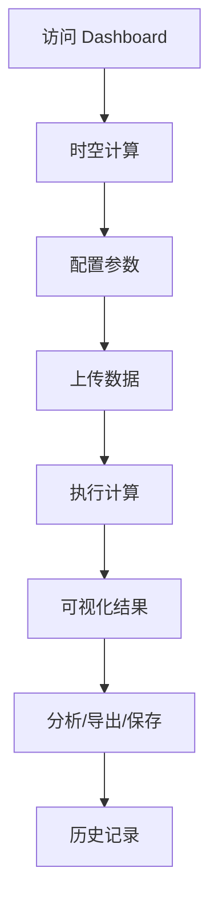

## 1. Product Overview
「HX-时空计算引擎」是一个面向未来的时空数据可视化与计算平台，提供沉浸式的时空数据分析、模拟推演和智能决策支持。
- 解决传统时空分析工具缺乏直观交互、复杂计算难以理解的问题，为科研、规划和决策人员提供强大的可视化和计算能力
- 目标成为行业领先的时空数据处理与可视化平台，提升时空数据分析效率

## 2. Core Features

### 2.1 User Roles
| Role | Registration Method | Core Permissions |
|------|---------------------|------------------|
| 普通用户 | 浏览使用基础功能 | 查看时空数据、使用基础计算、浏览历史记录 |
| 专业用户 | 专业认证 | 高级计算功能、自定义模拟、数据导出 |

### 2.2 Feature Module
1. **Dashboard**: 时空数据概览、核心指标展示、快捷操作入口
2. **时空计算**: 多维度数据计算、模拟推演、结果可视化
3. **数据管理**: 数据上传、数据预览、数据筛选
4. **历史记录**: 计算历史、结果对比、收藏管理

### 2.3 Page Details
| Page Name | Module Name | Feature description |
|-----------|-------------|---------------------|
| Dashboard | Hero Section | 沉浸式标题动画、系统介绍、快速开始按钮 |
| Dashboard | Key Metrics | 实时数据展示、动态数值变化、趋势图表 |
| Dashboard | Quick Actions | 核心功能快捷入口、图标动画、悬停效果 |
| Spacetime Calculation | Data Input | 参数配置、时空范围选择、计算模式切换 |
| Spacetime Calculation | Visualization | 3D/2D时空展示、数据图层、交互控制 |
| Spacetime Calculation | Results | 结果展示、详细数据、导出功能 |
| Data Management | Upload Area | 拖拽上传、文件预览、格式支持 |
| Data Management | Data List | 数据列表、筛选搜索、操作菜单 |
| History | Record List | 历史计算记录、时间线展示、结果对比 |

## 3. Core Process
用户访问 Dashboard 了解系统功能 → 选择时空计算功能 → 配置参数并上传数据 → 系统执行计算并可视化结果 → 用户分析结果、导出数据或保存计算记录

## 4. User Interface Design
### 4.1 Design Style
- **Primary Colors**: 深空蓝 (#0F172A)、科技蓝 (#3B82F6)、星空紫 (#7C3AED)
- **Button Style**: 渐变圆角按钮、悬停发光效果、点击动画
- **Font**: 未来感无衬线字体 Orbitron（标题）+ Inter（正文）
- **Layout Style**: 卡片式布局、玻璃态效果、深色主题
- **Icon Style**: 线性图标、科技感配色、微妙动画

### 4.2 Page Design Overview
| Page Name | Module Name | UI Elements |
|-----------|-------------|-------------|
| Dashboard | Hero Section | 渐变背景、粒子动画、居中布局、大型标题 |
| Dashboard | Key Metrics | 玻璃态卡片、动态数字、趋势箭头、色彩区分 |
| Dashboard | Quick Actions | 网格布局、图标卡片、悬停放大、色彩渐变 |
| Spacetime Calculation | Visualization | 深色背景、3D视差、图层控制、交互工具栏 |
| Data Management | Upload Area | 虚线边框、拖拽提示、文件图标、进度动画 |
| History | Record List | 时间线布局、状态标签、对比按钮、展开详情 |

### 4.3 Responsiveness
- Desktop-first design, adaptive to tablet and mobile
- Touch-optimized interactive elements
- Collapsible sidebar on mobile
- Responsive grid layout for content areas

### 4.4 3D Scene Guidance
- **Environment**: 深空星空背景，HDRI 环境贴图
- **Lighting**: 蓝色主光源 + 紫色补光，营造科技氛围
- **Camera**: 轨道控制器，支持缩放、旋转、平移
- **Composition**: 中心数据可视化主体 + 周围控制面板
- **Interactions**: 点击选择、悬停高亮、数据详情弹窗
- **Animations**: 粒子流动、数据脉动、视角过渡
- **Post-processing**: 轻微辉光效果、色彩校正
