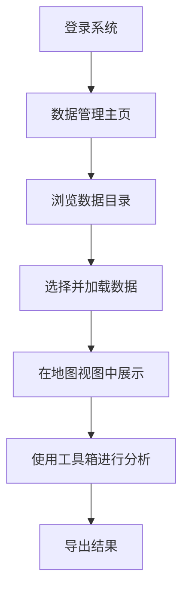

## 1. Product Overview
数据管理系统是一个用于管理地理空间数据的专业工具，提供数据浏览、数据目录、图层管理和空间分析等功能。主要面向需要处理遥感影像、地图数据的专业用户。

## 2. Core Features

### 2.1 User Roles
| Role | Registration Method | Core Permissions |
|------|---------------------|------------------|
| 系统用户 | 系统登录 | 数据浏览、上传、管理和分析 |

### 2.2 Feature Module
1. **数据管理页**: 顶部导航栏、侧边数据目录面板、主地图视图、右侧工具箱
2. **数据目录**: 原始库/标准库/融合库切换、数据搜索、高级筛选
3. **图层管理**: 图层列表、图层控制、数据导出
4. **工具箱**: 空间分析、几何分析、地图输出

### 2.3 Page Details
| Page Name | Module Name | Feature description |
|-----------|-------------|---------------------|
| 数据管理页 | 顶部导航栏 | 系统标题、导航菜单、用户信息 |
| 数据管理页 | 侧边数据目录 | 数据树结构、搜索框、上传按钮 |
| 数据管理页 | 主地图视图 | 遥感影像展示、坐标信息、缩放控制 |
| 数据管理页 | 工具箱 | 可展开的分析工具菜单 |

## 3. Core Process
用户登录后进入数据管理页面，可以通过左侧目录浏览和上传数据，选择数据后在主视图中展示，通过右侧工具箱进行空间分析操作。

## 4. User Interface Design
### 4.1 Design Style
- 主色调: 蓝色系 (#165DFF, #4080FF)
- 辅助色: 白色、浅灰
- 按钮风格: 直角矩形、蓝色填充、白色文字
- 字体: 系统默认无衬线字体
- 布局风格: 三栏式布局（左-中-右）
- 图标风格: 简洁的线性图标

### 4.2 Page Design Overview
| Page Name | Module Name | UI Elements |
|-----------|-------------|-------------|
| 数据管理页 | 顶部导航栏 | 固定高度、蓝色背景、左侧logo、中部菜单、右侧用户区 |
| 数据管理页 | 侧边数据目录 | 白色背景、可折叠面板、树状数据结构、搜索输入框 |
| 数据管理页 | 主地图视图 | 中央区域、地图影像、底部坐标信息、右侧工具栏 |
| 数据管理页 | 工具箱 | 右侧悬浮、可展开、工具菜单分类 |

### 4.3 Responsiveness
桌面端优先设计，暂不考虑移动端适配。

